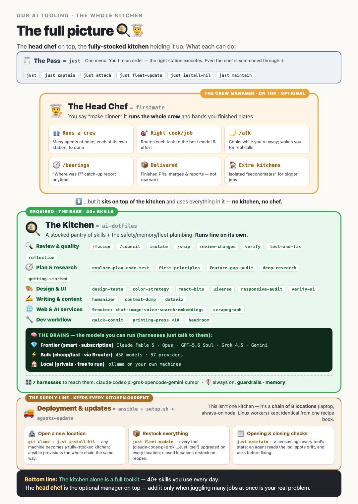

# AI orchestration — the high-level map

How the pieces of this repo fit together, top to bottom, and how one typed command flows through
them. Read this once; after that, `just` (the menu) is the everyday interface.



## The stack

Six layers. Each one only talks to the layer beneath it — that's what keeps the system legible.

| Layer                 | What it is                                                                                        | Lives                                      |
| --------------------- | ------------------------------------------------------------------------------------------------- | ------------------------------------------ |
| **1 · Operator**      | You, typing `just <recipe>` on the HUD (laptop) — or a captain chat                               | anywhere                                   |
| **2 · Launchpad**     | [`justfile`](../justfile) — every workflow named, documented, one keystroke                       | this repo, every host                      |
| **3 · Provisioning**  | `setup.sh` (one machine) + [`ansible-ai/`](../ansible-ai/README.md) (fleet)                       | control node → all hosts                   |
| **4 · Session layer** | herdr server + persistent session — panes survive laptop lids and reboots                         | the **node** (always-on Mac)               |
| **5 · Crew**          | firstmate: you captain one agent; it spawns/supervises crewmates in herdr panes                   | the node (`~/firstmate`)                   |
| **6 · Models**        | harnesses (claude/codex/pi/grok/…) → frontier APIs direct; bulk via 9router; context via headroom | per-host; 9router on dedicated fleet boxes |

Machine roles, not machine names: the **HUD** (your laptop — ephemeral, a viewport), the **node**
(always-on Mac — sessions, crew, and state live here), and **workers** (Linux fleet — bulk models,
scrapers, extra hands). The HUD holds no state: close it, travel, reattach.

## How a command flows

```
you: just captain
 └─ justfile → ssh <node> (recipe encodes WHERE it runs — you never think about it)
     └─ herdr-node.sh up          # session server verified/started (launchd keeps it alive)
     └─ cd ~/firstmate && claude  # AGENTS.md makes this Claude your first mate
         └─ first mate spawns crewmates → each in its own herdr pane + git worktree
             └─ harness → model (frontier direct · bulk via 9router · trimmed by headroom)
                 └─ deliverable: PR / merged branch / report, back to you in chat
```

```
you: just fleet-update
 └─ justfile → ansible-playbook update.yml (ai_all = every host)
     └─ per host: pull this repo → reassemble config → agents-update.sh roster
        (claude, codex, pi, grok, gemini, opencode, headroom, just itself)
```

## Lifecycle: install & maintain

The three-part pattern (deterministic scripts + a Setup hook + agentic prompts):

1. **Deterministic** — [`scripts/setup-init.sh`](../scripts/setup-init.sh) (tool census) and
   [`scripts/setup-maintenance.sh`](../scripts/setup-maintenance.sh) (updates/prune/cleanup), both
   logging structured lines to `~/.claude/logs/setup.log`.
2. **Hook** — [`.claude/settings.json`](../.claude/settings.json) fires them on
   `claude --init` / `--maintenance`, before the session boots.
3. **Agentic** — [`/install`](../commands/install.md) and [`/maintain`](../commands/maintain.md)
   read the log, close gaps, ask role questions, and carry the known-issues playbook (PATH in
   non-login shells, shell-rc pane pollution, hook conflicts, offline-host handling). Report-first:
   nothing mutates without confirmation.

Entry points: `just install-hil` (onboarding, human-in-the-loop) · `just maintain` ·
`just fleet-maintain`.

## Review & hardening

- **Fusion / council / isolate** — the pre-implementation review pipeline: two-model fusion,
  an 8-lens adversarial council, and a clean-room cold reviewer, composed into the SHIPIT loop.
  See [FUSE.md](../FUSE.md) and [SHIPIT.md](../SHIPIT.md).
- **Hardening stage** — messy-but-working builds (yours, or a crew's) can be steamrolled through a
  formal SDLC by an external orchestrator; the seam is a one-call hand-off of `{build_ref, intent}`.
  Speed where you want it, discipline where you need it.

## Where truth lives (so docs don't drift)

| Question                                    | Source of truth                                               |
| ------------------------------------------- | ------------------------------------------------------------- |
| What commands exist?                        | `just` (the justfile's own doc lines)                         |
| What's on each host / how do fleets update? | [`ansible-ai/README.md`](../ansible-ai/README.md) + inventory |
| How does review work?                       | [FUSE.md](../FUSE.md) / [SHIPIT.md](../SHIPIT.md)             |
| What happened during setup?                 | `~/.claude/logs/setup.log`                                    |
| This page                                   | only the map — layers, roles, flow                            |
