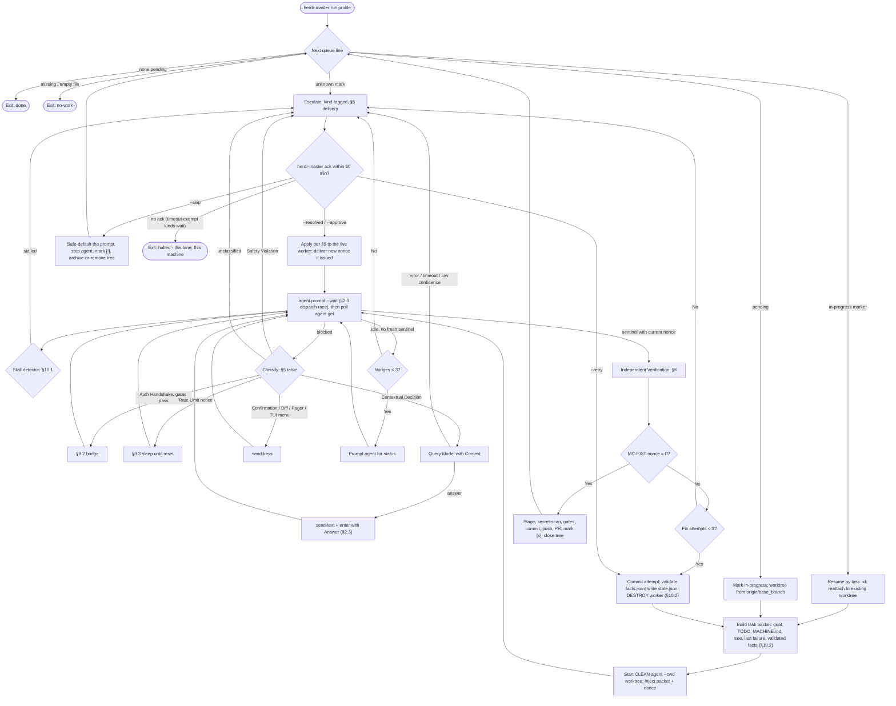

# Master Control Herdr Plan (Chief of Staff Architecture)

## 0. What This Document Is

An **architecture plan**, and two conventions govern how to read it:

1. **Invariants are the contract; code is a sketch.** Every shell snippet, regex, and JSON
   blob below illustrates an invariant stated in prose next to it. The invariant is what must
   hold. A snippet is a first cut at satisfying it against tools whose real surface is
   unverified (§11.1) and is expected to change during implementation; the invariant is not.
   Where a snippet and its invariant disagree, the invariant wins and the snippet is a bug.
2. **Two lanes, two threat models.** The system runs two kinds of work with genuinely
   different trust properties, and conflating them produced most of this plan's earlier
   defects:

   |                     | **TODO lane** (§3)                    | **Incident lane** (§8)                                                            |
   | ------------------- | ------------------------------------- | --------------------------------------------------------------------------------- |
   | Work source         | The operator's own `TODO.md`          | Inbound alerts from the internet                                                  |
   | Agent is assumed    | Fallible, not hostile                 | **Potentially hostile** — its input is attacker-influenced (prompt injection, §8) |
   | OS user             | Operator's own; no privilege boundary | Dedicated `herdr-agent` user; boundary enforced                                   |
   | Credentials in pane | Operator's, unavoidably               | None. The supervisor performs all git/network writes                              |
   | Supervisor's role   | Productivity supervisor               | Security boundary                                                                 |

   §10.4 states the enforcement. **Nothing in the TODO lane is a security control against a
   determined agent, and this document no longer claims otherwise** — within one OS user, an
   agent can edit any file the supervisor owns, including its own configuration and the
   action log. That is acceptable for the operator's own task queue and unacceptable for
   internet-sourced work, which is why the lanes differ.

---

## 1. Executive Summary

Autonomous coding agents (Claude Code, Codex, Grok, Devin, etc.) operating across multiple machines frequently stall due to:

- **Interactive blocking prompts** (`[y/N]`, numbered TUI permission menus, license terms, diff approvals).
- **Ambiguous fork questions** ("Should I use X or Y?", "Where should I create this file?").
- **Premature completion declarations** (declaring a task complete without running or passing unit tests).
- **Environment disconnects** (network drops, machine-specific config divergence, terminal session death).

**Master Control Herdr** is a "Chief of Staff" supervisor layer built on top of [Herdr](https://herdr.dev). It monitors agent terminals across local and remote machines (via Tailscale/SSH), polls their state, unblocks the prompts it is authorized to unblock, enforces Definition-of-Done through independent verification, and drives work units toward completion — escalating to a human on anything it is not authorized to decide.

**It does not run unattended to completion.** A per-machine run rests in one of four states: `running`, `suspended` (an escalation is open, §5), `finished` (`done` / `no-work` / `halted`), or `aborted` (§10.3). An escalation suspends; the operator's `ack` either resumes the run or finishes it. Every figure this document could have asserted about how often that happens is unmeasured until §11.2.

---

## 2. System Architecture

```
                    ┌────────────────────────────────────────────────────────┐
                    │               MASTER CONTROL ORCHESTRATOR              │
                    │               (Chief of Staff Supervisor)              │
                    └───────────┬────────────────────────────────┬───────────┘
                                │                                │
            Local Unix Domain   │                                │  Tailscale / SSH
            Socket (same host)  ▼                                ▼
       ┌─────────────────────────────────┐              ┌─────────────────────────────────┐
       │     MACHINE A (Primary Mac)     │              │    MACHINE B (Remote Worker)    │
       │                                 │              │                                 │
       │  ┌───────────────────────────┐  │              │  ┌───────────────────────────┐  │
       │  │ MACHINE.md Context Pack   │  │              │  │ MACHINE.md Context Pack   │  │
       │  └─────────────┬─────────────┘  │              │  └─────────────┬─────────────┘  │
       │                │                │              │                │                │
       │  ┌─────────────▼─────────────┐  │              │  ┌─────────────▼─────────────┐  │
       │  │        Herdr Server       │  │              │  │        Herdr Server       │  │
       │  │  ┌────────┐┌──────┐┌────┐ │  │              │  │  ┌────────┐┌──────┐┌────┐ │  │
       │  │  │ Worker ││Verify││Shell│ │  │              │  │  │ Worker ││Verify││Shell│ │  │
       │  │  │  Pane  ││ Pane ││Pane │ │  │              │  │  │  Pane  ││ Pane ││Pane │ │  │
       │  │  └────────┘└──────┘└────┘ │  │              │  │  └────────┘└──────┘└────┘ │  │
       │  └───────────────────────────┘  │              │  └───────────────────────────┘  │
       └─────────────────────────────────┘              └─────────────────────────────────┘
```

Transport is a property of _where the orchestrator runs_, not of the machine: panes on the
orchestrator's own host are reached over the local Unix domain socket; every other machine over
Tailscale SSH. The same applies to the §8 diagram.

### Core Components

1. **Machine Context Pack (`MACHINE.md`)**:
   - Defines local paths, ports, panes, verification commands, timezone, and conventions (schema in §4).
   - Injected into agent sessions — into every per-attempt worker, since each one starts with an empty context (§10.2) — to preemptively answer environmental questions.
   - **Two copies.** The repo-tracked copy is injected into the agent. The **supervisor-owned copy** at `~/.herdr-master/machines/<profile>/MACHINE.md` supplies every value the supervisor acts on, and is read fresh at each use (not cached at session start): `test_cmd`, `lint_cmd`, timezone, allowlists, exhaustion patterns. Reading configuration from the agent's writable checkout would let a worker set its own `test_cmd`.
   - Changes are adopted deliberately: `herdr-master trust <profile>` re-records the SHA-256. Each read compares against the recorded hash; a mismatch **suspends** the run with an open escalation carrying the diff (it does not halt — the operator can `--retry` after trusting).
   - **In the TODO lane this is a mistake-catcher, not a security control** (§0): the agent runs as the same user and could edit the file and the hash together. In the incident lane the separate user makes it real.

2. **Decision Sources (precedence order)**:
   Supervisor-owned `MACHINE.md` → the repo's `SPEC.md` if present (an optional per-repo design doc) → the repo's `README.md`. If none answer, escalate rather than guess. Used by §3, §5, and §8.

3. **Herdr Runtime Interface**:
   - Uses Herdr's session persistence so agent processes survive disconnections and sleep modes.
   - **This plan is invasive by design.** It injects keystrokes and prompts into live sessions; nothing here is passive telemetry. Every injected action — pane, timestamp, matched rule, keys or prompt sent, triggering buffer excerpt — is appended to `~/.herdr-master/actions.jsonl`. This is an audit trail against mistakes and for reconstruction, **not** tamper-evident against a same-user agent in the TODO lane; in the incident lane the log is owned by the operator user and the agent user cannot write it.
   - **Capabilities depended on**, probed against **herdr 0.9.0** (client and server, protocol 22, socket `~/.config/herdr/herdr.sock`) on 2026-09-12. Every row below was run. `✓` means the real invocation is in the Real column and works; `✗` means the assumed invocation does not exist and the Real column is the replacement.

     | Capability                        | Real invocation (verified 0.9.0)                                                                               | Assumed                       | Used by          |
     | --------------------------------- | -------------------------------------------------------------------------------------------------------------- | ----------------------------- | ---------------- |
     | Create a named session            | ✗ `herdr --session <name>`; `session` has only `list`/`attach`/`stop`/`delete`                                 | `session ensure <name>`       | §7 bootstrap     |
     | Split a pane, returning its id    | ✓ `herdr pane split <id> --direction right\|down [--ratio F] [--cwd PATH] [--env K=V] --no-focus`              | `--print-id`                  | §7, §8           |
     | Bind a stable name to a pane id   | ✗ **No such capability.** `herdr pane rename <pane_id> <label>` sets a display label only; the label is not addressable | `pane name`                   | §7               |
     | Start an agent in a pane          | ✗ `herdr agent start <NAME> --kind <KIND> --pane <ID> [--timeout MS]` — **no `--cwd`**                         | `agent start … --cwd <dir>`   | §3, §8           |
     | Send a prompt to an agent         | ✓ `herdr agent prompt <TARGET> <TEXT> [--wait] [--until S] [--timeout MS]`                                     | same                          | §3, §5, §8       |
     | Send raw keys / literal text      | ✓ `herdr agent send-keys` / `herdr pane send-keys`; also `herdr pane send-text <id> <text>`                    | same, minus `send-text`       | §5, §6, §10.3    |
     | Read an agent's / a pane's buffer | ✓ `… read <TARGET> --source recent-unwrapped [--lines N]`; `agent read` also offers `detection`                | same                          | §5, §6, §10.1    |
     | Poll agent state (non-blocking)   | ✗ `herdr agent get <target>` → JSON                                                                            | `agent status <name>`         | §3, §7           |
     | Bounded wait on state             | ✓ `herdr agent wait <TARGET> --until <S> --timeout <MS>`; states `idle\|working\|blocked\|done\|unknown`       | same                          | §3 (≤30 s)       |
     | Run a shell command in a pane     | ✓ `herdr pane run <PANE_ID> <COMMAND>…` — **fire-and-forget**                                                  | same                          | §6, all git work |
     | Block until output matches        | ✓ `herdr pane wait-output <id> (--match TEXT\|--regex PAT) [--source S] [--timeout MS]` → `matched_line`       | **not known to exist**        | §6 (see below)   |
     | Pane process tree / activity      | ✗ `herdr pane process-info --pane <id>` → `shell_pid`, `foreground_process_group_id`, `foreground_processes[]` | `pane info --pid`             | §10.1            |
     | Register a machine                | ✓ `herdr machine add\|list\|rename\|remove\|enable\|disable`                                                   | same                          | §7               |
     | Address a remote machine          | ✗ `herdr --remote <ssh-target>`; there is **no `--machine` flag**                                              | `herdr --machine <profile> …` | §7               |

     Four results change the design rather than just its spelling.

     **`pane run` is fire-and-forget.** It prints nothing, and the `herdr` process exits `0` whatever the command did. The §2.3 exit-protocol invariant below is therefore not defensive style, it is the only way to obtain an exit code, and it is now **verified**: `pane run <id> 'sleep 2; { false ; } ; printf "MC-EXIT n9f2 %d\n" "$?"'` produced the line `MC-EXIT n9f2 1`. A second result matters for the wrapper. The command runs **in the pane's own shell**, so a bare `exit <n>` inside it terminates that shell and destroys the pane. The `{ … } ; printf` form is required, not merely preferred.

     **`pane wait-output --regex` exists and returns structured JSON**, including `matched_line`. §6 specifies polling `pane read` on a timer for `MC-EXIT <nonce> <n>`; one blocking `wait-output` call replaces that loop, keeps the same nonce correlation, and removes the poll-interval knob entirely. Reads themselves stay text: `pane read` returns a plain terminal dump while `pane list`, `pane split`, `agent get`, `pane process-info`, and `wait-output` all return JSON on stdout. The "buffer text is not a return value" invariant therefore applies to reads specifically, and structured state is available everywhere else.

     **Working directory is a pane property, not an agent property.** `agent start` has no `--cwd` and requires a pane already sitting at an interactive shell prompt. The cwd must be set when the pane is created, by `pane split --cwd <tree>` (verified: a pane split with `--cwd /tmp` reported `cwd: /private/tmp`), or by a `pane run … cd` before the agent starts. Every "started there with `--cwd`" in §2.4, §3, §8, and §10.2 means the pane, not the agent.

     **A freshly started agent is blocked before it can be prompted.** `agent start` on a clean pane returned `agent_not_ready` with `agent probe-amnesia is blocked during startup and is not ready for prompts`, and `agent get` showed `agent_status: blocked` with `launch_pending: true`. The buffer held Claude Code's folder-trust menu, whose default selection is `No, exit`. This composes badly with a documented `agent prompt` behavior: **if the agent is already blocked, submission is rejected with `agent_blocked` before any input is sent.** So the dispatch sequence cannot be start-then-prompt, and §5's row 7 cannot answer a blocked agent with `agent prompt` at all. Blocked agents are reachable only through `send-keys` and `send-text`. `launch_pending` is the field that distinguishes a startup block from a mid-task block, and §5 should key on it.

     **Results from a live end-to-end run** (2026-09-12, one work unit driven by hand through §3's full lifecycle on a throwaway repo: worktree, split, start, unblock, prompt, verify, commit, close). The lane completed and verification passed independently, at roughly 15 s of agent time for a trivial task. Three further results:

     - **Pane names are not addressable.** `pane rename <id> mc-worker` succeeded and `pane get mc-worker` then returned `pane_not_found`. `rename` sets a display label. The supervisor must therefore hold its own name-to-id map in `state.db` and re-resolve it on restart, and §7's bootstrap cannot rely on binding a configured name to a pane.
     - **`agent prompt` returns before the agent transitions.** The call returned with `agent_status: idle`, and the agent was still `idle` on the next poll, reaching `working` only about 5 s later. A supervisor that polls immediately after dispatch reads `idle`, finds no sentinel, and takes §3's "idle, no fresh sentinel" branch, burning a nudge on every dispatch. `agent prompt --wait` exists for exactly this and documents a 5000 ms readiness window; §3 uses it rather than polling raw.
     - **`agent wait` returns plain text**, not JSON, joining `pane read`. Everything else measured here returns JSON on stdout.

     One negative result, recorded because it was deliberately provoked. The injected prompt was made to contain the literal completion sentinel, violating the §2.3 invariant below. It did **not** collide: the sentinel appeared once in `recent-unwrapped`, because Claude Code's TUI collapses its input area and never retained the injected copy. That is per-CLI rendering behavior rather than a guarantee, and another agent kind may echo its prompt verbatim. **The invariant stands**; this run simply failed to falsify it.

     Also present and unused by this plan: `herdr api snapshot` and `herdr api schema` for live structured state, `herdr worktree create|list|open|remove` for native worktree-backed workspaces, and 23 values for `--kind` including `claude`, `codex`, `gemini`, and `cursor`, which is what makes §10.2's per-attempt model rotation reachable.

   - **Where state lives, and who reads it.** Supervisor-owned state — `state.db`, `actions.jsonl`, the recorded config hashes — lives on the **orchestrator host only**, under `~/.herdr-master/`, and the daemon reads it with ordinary file I/O. It is never read through a pane. What lives on each worker is the machine's own `MACHINE.md` and repos; the daemon fetches `MACHINE.md` once per session start and per config read via `pane run … cat`, verifies its hash against the orchestrator-side record, and **parses the fetched copy in the daemon** rather than acting on buffer text. The `0600`/`0700` and ownership claims in §10.4 are about the orchestrator host. Per-machine queues therefore live at `~/.herdr-master/machines/<profile>/TODO.md` on the **orchestrator**, describing work on that machine.

   - **All filesystem and git work on a worker happens through `herdr pane run` on a non-agent `shell_pane`** — fetching `MACHINE.md`, writing `alert.txt`, `git worktree add`, staging, `git status`. The orchestrator never assumes a shared filesystem with a remote machine, and never types shell commands into an _agent_ pane (the agent would read them as a request). **Credential-bearing operations are the exception and never run in a pane** (see §8.4): `git push` and `gh pr create` are executed by the daemon against the remote, because interpolating a token into a `pane run` command would place it in the pane scrollback and in `actions.jsonl`. `actions.jsonl` additionally redacts any value matching the secret patterns before writing, so an OTP the bridge injects (§9.2) is logged as `<redacted>`.

   - **Git run by the supervisor inside an agent-controlled tree is hardened.** Hooks and repo-local config in a tree the agent can write are executable code the agent chose: every supervisor-issued git command uses `git -c core.hooksPath=/dev/null -c core.fsmonitor=false` with `GIT_CONFIG_GLOBAL=/dev/null GIT_CONFIG_SYSTEM=/dev/null`.

   - **Quoting**: the wrapper below composes shell text, so `<cmd>` is passed as a single-quoted string with embedded single quotes escaped (`'\''`), or written to a temp script and invoked by path. An unescaped quote in a path or command silently truncates the wrapper and loses the status line.

   - **Invariant: every `pane run` is checked.** Buffer text is not a return value. The wrapper used for _all_ shell work — not only §6 verification — appends a nonce-tagged status line, and the supervisor treats a missing or non-zero line as failure and escalates:

     ```bash
     herdr pane run <pane-id> '{ <cmd> ; } ; printf "MC-EXIT <nonce> %d\n" "$?"'
     ```

     Without this, a failed `git worktree add` is followed by `agent start --cwd <nonexistent>`, and a failed `gh pr create` is followed by a reply email announcing a PR that does not exist.

   - **Invariant: no sentinel is ever matched without its current nonce.** Buffers retain history, so a bare `MASTER-CONTROL: TASK-DONE` or `MC-EXIT` from a previous attempt re-matches on the next poll and verification runs on stale evidence. Every supervisor-recognized sentinel — completion, shell exit, health probe — carries a fresh single-use nonce issued by the supervisor for that one operation, and retired nonces are logged and ignored. In the incident lane, where one `verify_pane` serves several incidents, the nonce is also the correlation token.
   - **Invariant: a sentinel matches only as literal-plus-current-nonce, as one unit.** `MACHINE.md` necessarily contains the literal sentinel string (rule 6) and `MACHINE.md` is injected, so "injected text never contains the literal" is unachievable. What is achievable, and is the rule: the matcher requires the literal immediately followed by the nonce for the current operation, and the supervisor's own injected prompts never contain that pair — the task prompt supplies the nonce separately and refers to the sentinel by name. Echo of an injected prompt therefore cannot match.

4. **Work Units** — the TODO lane and the incident lane share one lifecycle, because every place they diverged in earlier drafts was a defect:

   | Stage     | TODO lane                                                                        | Incident lane                                                                      |
   | --------- | -------------------------------------------------------------------------------- | ---------------------------------------------------------------------------------- |
   | Identity  | `task_id`, recorded in the queue line itself (§2.5)                              | `incident_id` (§8)                                                                 |
   | Base      | `base_branch` from `MACHINE.md`                                                  | `base_branch` from `ROUTER.json`                                                   |
   | Isolation | Linked worktree `wt-<task_id>` on `task/<task_id>`, from `origin/<base_branch>`  | **Separate clone** owned by `herdr-agent` (below), on `fix/incident-<incident_id>` |
   | Dispatch  | Pane created with `--cwd` there, then agent started in it (§2.3), `MACHINE.md` injected, nonce issued | Identical                                                    |
   | Verify    | §6, in the work tree                                                             | §6, in the clone, in an **agent-user** verify pane                                 |
   | Land      | Supervisor stages, scans, commits, pushes, opens a PR — never auto-merged        | Identical                                                                          |
   | Close     | Remove the tree only **after** a successful push or archive; mark the queue line | Remove the clone and **close the sibling pane**; release the lease                 |

   **`task_id` is charset-constrained like `incident_id`**, and for the same reason: it is
   interpolated into refs and paths. `task_id = <slug>-<6 hex>` where the slug is the title
   lowercased, non-`[a-z0-9]` runs collapsed to `-`, trimmed of leading/trailing `-`, and
   truncated to 40 characters; the supervisor asserts `^[a-z0-9][a-z0-9-]{0,46}$` before use.
   An unsluggable title (no alphanumerics) escalates.

   **Why the incident lane uses a clone, not a linked worktree.** A linked worktree's
   administrative gitdir lives at `<repo_path>/.git/worktrees/<name>/` — inside a path the
   `herdr-agent` user must not write — so the agent could not stage or commit; and a linked
   worktree has no `.git/info/exclude` of its own (its `.git` is a file, and `info/exclude` is
   shared from the common dir), so the `.herdr-incident/` drop directory could not be excluded
   without editing the operator's repo. A separate clone under the agent user's own root has
   its own `.git`, its own exclude file, and no write path into `repo_path`. The TODO lane,
   which has no user boundary, keeps linked worktrees.

   **Closing a unit is always possible.** Neither lane deletes unpushed work, and neither runs
   `git worktree remove --force` on a dirty tree — but a dirty tree does **not** escalate at
   close time, because a skipped or stopped unit is almost always dirty and that made
   `--skip`/`--stop` unable to complete. Instead the supervisor **archives**: commit the tree
   to `abandoned/<unit_id>` and push it if a remote is reachable, otherwise `tar` it to
   `~/.herdr-master/abandoned/<unit_id>.tar.zst` on the orchestrator. Only then remove the
   tree. The archive location is reported in `herdr-master status`.

5. **Task Queue (`TODO.md`)** — location and authority stated, because a repo-tracked queue is read and written by the very agents it dispatches:
   - The authoritative queue lives on the **orchestrator host**, outside every work tree, at `~/.herdr-master/machines/<profile>/TODO.md`. A repo copy may exist for humans; the supervisor neither reads nor writes it.
   - Recognizer: a queue line matches `^- \[(?<mark>[ x!>])\] (?<title>.+)$`; indented continuation lines belong to the preceding task. Anything else in the file is prose and ignored; a line matching `^- \[` with an unknown mark escalates.
   - Marks: `[ ]` pending, `[>]` **in progress** with the assigned `task_id` appended as `<!-- id:fix-auth-timeout-9f2a1c -->`, `[x]` verified done, `[!]` quarantined (skipped or unparseable). The in-progress mark is what makes a daemon restart safe: a `[>]` line is reconciled by `task_id` (§2.6) rather than re-dispatched, so `git worktree add` is never re-run against an existing tree. Identity lives in the line, not in a positional index, so inserting a line mid-run cannot remap branches to different tasks.
   - A continuation line of the form `allow-test-changes: <reason>` authorizes this task to modify existing tests, which the §6 test-surface gate otherwise suspends.
   - `--skip` on any task escalation rewrites that task's mark to `[!]`. Without it the queue re-dispatches the task the operator just skipped, forever.
   - The run reaches `done` when no `[ ]` or `[>]` lines remain. `[!]` lines do not block `done`; `herdr-master status` reports their count, because a run that quarantined half its queue is not the same as a clean one.
   - Missing or empty file → `no-work`.

6. **Daemon, control channel, and persisted state** — everything about acks, restart safety, and
   shared counters depends on this, and it was previously unstated:
   - `herdr-master daemon` is a single long-lived process on the orchestrator host. It owns the
     per-machine asyncio poll tasks, the incident lane, the alert poller, the webhook receiver,
     and the auth bridge — one process, so "cancel the poll tasks in-process" (§10.3) is
     coherent and the replay cache, incident counters, escalation registry, and pane leases are
     genuinely shared rather than split across unrelated processes.
   - `run`, `stop`, `status`, `ack`, `trust`, and `abort` are **thin clients** over a Unix socket
     at `~/.herdr-master/control.sock` (mode `0600`). They hold no state and do nothing if the
     daemon is not running, which the client reports rather than silently succeeding.
   - **All supervisor state is persisted** in SQLite at `~/.herdr-master/state.db`, written
     transactionally at each transition: current nonce per unit, retry/nudge/reset/injection
     counters, pane leases, open escalations and their kinds, the incident registry, the
     webhook replay cache, and the `aborting` flag. Without persistence, a daemon restart
     resumes a `[>]` unit with no valid nonce — the agent's sentinel could never match, and the
     unit would be nudged three times and escalated.
   - **Restart reconciliation.** On start, for each `[>]` unit: confirm the work tree and the
     agent pane still exist (either missing → escalate rather than guess), then **issue a fresh
     nonce and deliver it to the agent** with a short resume prompt. Re-delivery is the point;
     a new nonce that the agent never receives is the same bug as no nonce at all. This applies
     equally to `--retry` (§5), which likewise delivers the nonce it issues.

7. **Triage & Decision Engine**: classifies blocked terminal output. §5's table is the single normative definition; §3's flowchart and every other reference defer to it.

---

## 3. Operational Lifecycle (The OODA Loop)



**Halt scope is one lane on one machine** (§8): a TODO halt never stops incident work, and neither stops other machines. A halted machine is restarted with `herdr-master run <profile>`, which reconciles from the `[>]` line (§2.6) — without that command, `halted` would be unrecoverable, since `--retry` exists only inside the ack window. `run` refuses if the agent is still blocked on the prompt that caused the halt, rather than re-classifying it and halting again (§10.3). `herdr-master stop <profile>` ends a run with no escalation open, and only `herdr-master abort` (§10.3) is fleet-wide.

---

## 4. Machine-Specific Context Specification (`MACHINE.md`)

The supervisor-owned copy (§2.1) is a schema: every field is read by a named section, and every
absence has a defined consequence rather than a silent default.

```markdown
# Machine Context & Autonomy Rules

- **Machine ID**: mac-studio-01
- **Profile**: worker-studio # must match a §7 registered profile, or `local`
- **Timezone**: America/Toronto # §9.3; absent -> rate-limit events escalate
- **Working Directory**: ~/projects/billing
- **Base Branch**: main # §2.4; absent -> TODO-lane dispatch escalates
- **Worktree Root**: ~/projects/.worktrees # §2.4
- **Runtime**: Rust 1.83, Docker, Postgres (5432)
- **Panes**: # §7 bootstrap creates any that are absent
  - `worker_pane`: billing-worker
  - `verify_pane`: billing-verify
  - `shell_pane`: billing-shell # non-agent pane for git/file work (§2.3)
- **Verification**:
  - `lint_cmd`: `cargo clippy -- -D warnings`
  - `test_cmd`: `cargo test`
  - `test_timeout_ms`: 600000 # absent -> 600000
  - `stall_idle_seconds`: 900 # §10.1; absent -> 900
- **Agent kinds & exhaustion patterns** (§10.2; unlisted kind -> escalate):
  - `claude`: `/context (left until |low|exhausted)|running out of context/i`
    # deliberately NOT a bare /compact/: "auto-compact" appears in routine status
    # output, and matching it fires a destructive reset on ordinary text

# The git/PR token backend is deliberately NOT here: the daemon reads it, the daemon

# runs on the orchestrator, and it has no access to a remote machine's keychain. Like

# the Chrome settings, `keychain` lives in the orchestrator's own config.

- **Dependency policy** (advisory to the agent; enforcement below):
  - `allowed_registries`: [`crates.io`]
  - `allowed_installers`: [`cargo add`]
- **Rules**:
  1. Use the runtime's native package manager only; never a second one.
  2. For database migrations, use `just db:migrate`.
  3. Do not ask before creating directories, or before an install satisfying the
     dependency policy. Anything outside it: stop and ask.
  4. Never ask "Should I run tests?". Always run tests before declaring work done.
  5. Follow the repo's existing directory structure.
  6. Signal completion with the completion sentinel and the nonce supplied with the
     task. (The literal sentinel string lives here and in the supervisor, and is
     deliberately never repeated in an injected prompt — §2.3.)
```

Chrome/browser prerequisites are **not** in this schema: Chrome runs only on the orchestrator
host, so they live in the orchestrator's own config (§9.2), not in every machine's file.

**How the dependency policy is enforced.** Rule 3 is an instruction, and an instruction is not
a control: an agent that misjudges the policy installs anyway, and having been told not to ask,
no prompt is ever classified. The producer is at land time, in the `shell_pane`:

- Invariant: **the gate must see every change, wherever it currently sits.** Agent work may be uncommitted, staged, committed, or untracked — and in the incident lane the agent may not have committed at all. The gate therefore runs **after the supervisor stages** (§6 land step, `git add -A` minus excludes) and **before it commits**, comparing `git diff --cached origin/<base_branch>` — which by then covers working-tree edits, prior agent commits, and new untracked files alike. The earlier `git diff origin/<base>...HEAD` saw only committed changes and missed the common case entirely.
- Manifest and lockfile changes are inspected together — the registry host and any `postinstall`/build script live in the manifest, not the lockfile, and `bun.lockb` is binary and must be read via `bun` rather than diffed as text.
- Covered names: `bun.lock`, `bun.lockb`, `package-lock.json`, `yarn.lock`, `pnpm-lock.yaml`, `Cargo.lock`, `uv.lock`, `poetry.lock`, `requirements*.txt`, `go.sum`, `Gemfile.lock`, and the manifests beside them.
- A registry outside `allowed_registries`, or a new dependency with an install script → escalate and block the land step. **`allowed_installers` is not enforceable from a diff** — a hand-edited `Cargo.toml` is indistinguishable from `cargo add` — so it remains purely advisory to the agent, and the registry check is what actually holds. Stated rather than implied.

---

## 5. Decision & Auto-Unblocking Strategy

When an agent blocks, Master Control classifies the buffer. **Precedence is load-bearing and evaluated top-to-bottom; the first matching row wins.**

**Match window** (undefined in earlier drafts, and the ordering argument depends on it): classification runs against the **current prompt block** — the trailing buffer from the last shell/agent prompt boundary to the cursor, capped at 40 lines. Matching the whole scrollback would let an hour-old line containing "delete" escalate every later `[y/N]`; matching only the final line would miss a consequence stated two lines above `Proceed?`.

Row 6 is the exception, and deliberately does not read the window: a diff can run to hundreds of lines and is truncated in the pane anyway. The supervisor obtains the **full** pending diff out of band — `git -C <tree> diff` via `shell_pane`, or the agent kind's own diff-dump command — and evaluates it there. Judging a 400-line threshold from a 40-line window was not possible.

| #   | Event Type               | Detected Pattern                                                                     | Automated Action                                                                                                                                                                                                                                                                                                                                                                                                                                                    |
| --- | ------------------------ | ------------------------------------------------------------------------------------ | ------------------------------------------------------------------------------------------------------------------------------------------------------------------------------------------------------------------------------------------------------------------------------------------------------------------------------------------------------------------------------------------------------------------------------------------------------------------- |
| 1   | **Auth Handshake**       | Device-code/activation prompt where **all** §9.2 gates pass                          | Hand to the §9.2 bridge; any gate failing falls through to row 2                                                                                                                                                                                                                                                                                                                                                                                                    |
| 2   | **Safety Violation**     | See the pattern set below                                                            | Escalate. Never auto-answered                                                                                                                                                                                                                                                                                                                                                                                                                                       |
| 3   | **Rate Limit**           | `LIMIT_ABS_REGEX` / `LIMIT_REL_REGEX` (§9.3)                                         | §9.3 sleep-and-resume. Without this row the feature is unreachable: a limit notice otherwise reads as `idle` or unclassified and escalates                                                                                                                                                                                                                                                                                                                          |
| 4   | **Verification**         | The completion sentinel bearing the **current** nonce                                | Trigger §6                                                                                                                                                                                                                                                                                                                                                                                                                                                          |
| 5   | **TUI Permission Menu**  | A numbered or arrow-key menu, or a `❯`-cursor selector                               | If the options are _permission_ choices (yes / yes-and-remember / no): select the plain-affirmative, **never** a "don't ask again" variant, which would permanently remove the prompt this table depends on. If the options are _substantive alternatives_ ("1. npm 2. bun 3. pnpm"): resolve the choice per row 7, then send the **keystroke** for the chosen option — never prose into a keystroke menu. No plain-affirmative and no resolvable choice → escalate |
| 6   | **Diff / Review Prompt** | `Accept this change?`, `Approve diff?`, or a diff viewer awaiting a decision         | Read the diff; if it matches any row-2 pattern, touches `.env` / credentials / CI config / `.github/workflows` / test or lint configuration (§6), or exceeds 400 changed lines → escalate. Otherwise approve                                                                                                                                                                                                                                                        |
| 7   | **Contextual Decision**  | A free-text question that is **not** answerable yes/no and **not** a menu            | **TODO lane only**: resolve against §2.2 sources; answer via `pane send-text` then `send-keys enter`, **never `agent prompt`**, which §2.3 measured as rejecting any blocked agent with `agent_blocked` before sending input. No answer, LLM error/timeout (30 s), or low confidence → escalate. **In the incident lane this row is disabled and always escalates** — see below                                                                                                                                                                                                                                      |
| 8   | **Pager / Continuation** | `-- More --`, `(END)`, or a lone `:` as the entire last line                         | Send `q`. (`enter` advances `less` one line and re-blocks)                                                                                                                                                                                                                                                                                                                                                                                                          |
| 9   | **Simple Confirmation**  | A **binary** confirmation: `[y/N]`, `[Y/n]`, `(y/n)`, `proceed?`, license acceptance | Send the affirmative key. `[Y/n]` is matched explicitly; omitting it left a common form unclassified                                                                                                                                                                                                                                                                                                                                                                |
| 10  | **Unclassified**         | Anything blocked matching no row above                                               | Escalate. The default is never "send y"                                                                                                                                                                                                                                                                                                                                                                                                                             |

Row 5 precedes row 7 so that a menu of named alternatives is answered with a keystroke rather
than prose — the reverse ordering made the menu row unreachable for exactly the menus that
need it. Rows 7 and 9 are disjoint by construction: row 7 is explicitly non-binary.

**Row 7 is disabled in the incident lane**, and §8's containment claim is stated accordingly.
The decision model reads the worker's prompt block and the repo's `SPEC.md`/`README.md` — all
of which an incident agent can write — so in that lane it is a second LLM consuming
attacker-influenced text, and an agent could seed `SPEC.md` to answer its own questions. The
correct claim is therefore narrower than "no LLM sees raw alert text": in the incident lane,
**exactly one** model sees it, the contained worker, and every fork it cannot resolve alone
escalates to the operator. When enabled in the TODO lane, the decision model runs on the
supervisor's own credentials with no tools and no filesystem access, receiving only the prompt
block and the decision sources as text.

**Row 2 pattern set.** No "affects more than one resource" qualifier — that is not evaluable
from prompt text, and while it stood, `"Delete branch main? [y/N]"` fell through to row 9 and
got a `y`. The set is a maintained allowlist-of-danger, versioned with the supervisor:

- _Destructive filesystem_: `rm -rf` / `-fr` / `-r -f`, `dd`, `mkfs`, `shred`, `chmod -R`, `chown -R`
- _Destructive git_: `push --force` / `-f` / `--force-with-lease`, `reset --hard`, `clean -f`, `checkout -- .`, `branch -D`, `rebase`, `stash drop`, `filter-branch`
- _Publishing / egress_ (the agent's user holds real credentials, §0): any `git push`, `npm publish`, `cargo publish`, `gh release`, `curl … | sh`, `ssh`, `scp`
- _Privilege_: `sudo`, `doas`
- _Data_: `DROP TABLE`, `DROP DATABASE`, `TRUNCATE`, `DELETE FROM` without `WHERE`
- _Infrastructure_: `terraform destroy`, `kubectl delete`, `docker system prune`, `aws s3 rm --recursive`
- _Credentials_: a prompt requesting a secret value — matched by an input mask (echo disabled), or by `(api[_ ]?key|token|password|secret|passphrase|otp|2fa|mfa)` within 2 lines of an input cursor — that row 1 did not claim
- _Catch-all_: `delete`, `drop`, `destroy`, `wipe`, `erase`, `overwrite`, `revoke`, `force` (case-insensitive) anywhere in the prompt block

The catch-all is deliberately over-broad; `--approve` (below) clears a false positive in one
command, and §11.2's escalate-heavy baseline is how the set gets tuned against real traffic.

### Escalation kinds and the ack matrix

An escalation carries a **kind**. Rather than an enumeration that is perpetually missing a
kind the document raises elsewhere, the rule is a **default plus exceptions**:

**Default, for every kind**: `--resolved`, `--skip`, and `--stop` are always accepted.
`--retry` and `--approve` are accepted only where the table below grants them. An ack the kind
does not accept is rejected by the client with the list of acks that kind does accept — never
silently ignored, and never leaving the escalation with no way out.

| Ack          | Effect                                                                                                                                                                                                                                                                                                                                                                      |
| ------------ | --------------------------------------------------------------------------------------------------------------------------------------------------------------------------------------------------------------------------------------------------------------------------------------------------------------------------------------------------------------------------- |
| `--resolved` | "I handled it in the pane; continue." Clears the `escalated` mark, re-engages any disengaged unblocker, re-reads the buffer, and resumes at `WaitState`. If the same condition immediately re-classifies, the new escalation is marked `repeat` and only `--skip`/`--stop` are offered, so it cannot loop.                                                                  |
| `--retry`    | Clears the mark, re-engages the unblocker, resets retry budget and nudge count, issues a fresh nonce **and delivers it** to the agent (§2.6). Where listed.                                                                                                                                                                                                                 |
| `--approve`  | Sends the affirmative for this one prompt, derived as row 5/6/9 would have: the key for a `[y/N]`, the option number for a menu, the approve action in a diff viewer. Where listed.                                                                                                                                                                                         |
| `--skip`     | Answers any outstanding prompt with the tool's safe default (`n`, or `Esc` where no safe key exists — including credential prompts, where `Esc`/`C-c` is the only correct answer), stops the agent, archives the work tree per §2.4, marks the queue line `[!]`, advances. Never escalates again.                                                                           |
| `--stop`     | Ends the affected **lane run on that machine** as `halted`, immediately. For a TODO unit the agent is left alive and blocked for inspection; for an incident unit the sibling pane is closed and the clone archived, because a live sibling would hold an incident slot forever (§8). Fleet-wide teardown is `herdr-master abort` — deliberately not reachable from an ack. |

**Exceptions granting `--retry` / `--approve`:**

| Kind                                                  | `--retry`                            | `--approve`                                  |
| ----------------------------------------------------- | ------------------------------------ | -------------------------------------------- |
| Safety Violation (row 2), Unclassified (row 10)       | —                                    | **yes**                                      |
| Diff-approval escalation (row 6), test-surface change | —                                    | **yes** — accept and continue                |
| Lockfile / dependency violation (§4)                  | —                                    | **yes** — accept the dependency, resume land |
| Retry budget exhausted                                | **yes**                              | —                                            |
| Stall detected (§10.1), nudge cap, injection cap      | **yes**                              | —                                            |
| `MACHINE.md` hash mismatch                            | **yes** — after `herdr-master trust` | —                                            |
| Machine offline (§7)                                  | **yes** — retry the connection now   | —                                            |
| Incident cap exceeded (§8)                            | **yes**                              | —                                            |
| Everything else                                       | —                                    | —                                            |

"Everything else" is the point of the default rule, and it covers the kinds an enumeration kept
omitting: unknown queue-line mark, verification unconfigurable, `pane run` with no `MC-EXIT`
line, push or PR-creation failure, secret-scan hit, unlisted agent kind, absent keychain
backend, rate-limit parse failure, missing timezone, OTP timeout, resync state mismatch,
unsluggable task title, auth-gate failure. Each is escalated with its kind, and each is
closable by `--resolved`, `--skip`, or `--stop`.

`--approve` is never offered for a credential-entry prompt: no keystroke constitutes approval
of a secret-value field. The operator types the secret in the pane and then acks `--resolved`
— which is exactly the gap that existed while `--retry` was rejected and nothing else applied.

### Escalation Delivery

1. Assign an escalation id and kind, persist it (§2.6), append to the action log, mark the pane `escalated` — blocking further automated input until an ack clears it, including the safe-default keys `--skip` sends, which clear the mark first.
2. Push notification to the operator's phone. **ntfy self-hosted on the tailnet** is the default, because it is the only option that keeps the alert inside the tailnet; Pushover and hosted ntfy are supported but are public SaaS and are labeled as such in config, since escalation bodies name machines, services, and work units.
3. If the orchestrator host is the operator's desktop, additionally: OS notification + chime.
4. Unacknowledged after 30 minutes → that machine's run exits `halted`. Other machines continue. **Two kinds are exempt from the timeout** and suspend indefinitely instead: `machine offline` (§7), where a laptop asleep for a weekend should reconnect and resync rather than convert to `halted`, and `MACHINE.md hash mismatch`, which needs a deliberate `trust` and has no safe default.

---

## 6. Definition-of-Done & Verification Engine

**Rule: Never trust the worker agent's self-assessment.**

The worker's signal is a _trigger_, never evidence:

- **`idle`** — waiting on input with no fresh completion claim. Nudge for status, at most 3 times, then escalate. Nothing is verified or marked.
- **`done`** — the completion sentinel with the current nonce (§2.3). A sentinel with a retired nonce is logged and ignored, so a claim from a failed attempt cannot re-trigger verification off the buffer's history.

### Verification procedure

1. **Resolve the command from supervisor-owned configuration** — `lint_cmd` and `test_cmd` from `MACHINE.md` (§2.1). `verification_cmd` in `ROUTER.json` overrides `test_cmd` **only**; `lint_cmd` still runs, since an override that silently dropped linting would weaken the gate it was meant to specialize. No test command from either source → the unit cannot be verified: escalate, never mark done.
2. **Run it in the bound `verify_pane`, in the unit's work tree**, under the §2.3 exit protocol:

   ```bash
   herdr pane run <verify-pane-id> \
     'cd "<tree>" && { <lint_cmd> && <test_cmd> ; } ; printf "MC-EXIT <nonce> %d\n" "$?"'
   ```

   The `cd` is mandatory: without it the pane tests `repo_path` — the unfixed tree — and reports green on work it never saw. The nonce is mandatory as a correlation token, since a bare exit line from a previous run is indistinguishable from this one's.

   **Pane serialization.** `verify_pane` and `shell_pane` are a single shell each, so they are leased exactly like worker panes: a `pane run` issued into a pane mid-`cargo test` types into the running process rather than starting a command. Work units queue for these panes FIFO, and the queue depth is reported in `herdr-master status`. The nonce correlates; it does not permit interleaving, and an earlier draft implied it did. If queueing behind other incidents becomes the bottleneck, the fix is a verify pane per concurrent slot — configuration, not protocol.

3. The supervisor blocks on `herdr pane wait-output <verify-pane> --regex 'MC-EXIT <nonce> [0-9]+' --source recent-unwrapped --timeout <test_timeout_ms>`, which §2.3 verified returns the matched line as JSON. An earlier draft polled `pane read` on a timer; the blocking call is equivalent, keeps the same nonce correlation, and removes the poll-interval knob. Outcomes are total:
   - `0` → pass, subject to the independence check below.
   - non-zero → fail. The trace is captured from the same verification-pane read — not from the worker, which never ran the tests — and fed back with the real exit code interpolated and a new nonce issued.
   - **Timeout with no line** → failure. Interrupt the pane (`pane send-keys C-c`), capture the partial buffer, count the attempt.

### Verification independence — and its real limit

A supervisor-owned _command string_ does not make the _executed code_ supervisor-owned. `bun run lint` runs an agent-editable `package.json` script; `pytest`, `cargo test`, and `bun test` load agent-editable `conftest.py`, `build.rs`, and the test files themselves. An agent that deletes a failing test or sets `"lint": "true"` passes a green build. Three controls, and an honest residual:

- **Verification executes as the agent, not as the operator.** This is the correction that makes §10.4's boundary real rather than nominal: running an incident unit's `cargo test`, `pytest`, or health command in an operator-owned pane executes agent-authored `build.rs`, `conftest.py`, and service code **as the operator**, with the keychain, SSH keys, and `gh` token reachable. The incident lane therefore has its **own** `verify_pane` and `shell_pane` running as `herdr-agent`, and only the land step — which needs the token — runs elsewhere, from the daemon (§2.3). The TODO lane, having no boundary to protect, shares the operator's panes.
- **Test-surface diff gate.** Before accepting a pass, the supervisor diffs the staged tree against `origin/<base_branch>` for changes to test files, fixtures, and lint/build configuration, and distinguishes them: **added** test files pass (writing a regression test is required by §8 and must not deadlock the lane — and an added file cannot weaken an existing assertion), while **modified or deleted** test files suspend the pass and escalate with the diff. Authorization to modify tests comes from a producer in each lane: `allow-test-changes:` on the queue line (§2.5), or `"allow_test_changes": true` on the service in `ROUTER.json`. Never from the alert text, which is attacker-influenced. Row 6 of §5 escalates the same changes at diff-approval time.
- **The PR is reviewed by a human** before merge, always (§2.4). That is the backstop.
- **Residual:** an agent that subtly weakens an assertion inside a file it was authorized to change passes every gate above. This plan does not close that, and no supervisor logic inside the same repo can; the `herdr-agent` boundary narrows the blast radius to the repo rather than the machine, which is the honest extent of the claim.

A unit is marked `[x]` only after a nonce-matched `MC-EXIT … 0`, a clean test-surface gate, a clean dependency gate (§4), and a **successful push**. The work tree is removed after the push succeeds or the archive completes (§2.4), never before.

### The land step

Staging was previously unspecified, and the only stated policy — an earlier §10.2's `git add -u` — would have dropped the new regression test and any new module. §10.2 now defers to this rule for its attempt commits, so there is one staging policy rather than two that disagree. The land step is performed by the daemon, and in this order:

1. `git add -A` in the work tree, minus a fixed exclude set: `.herdr-incident/`, `.herdr/`, `.env*`, `*.pem`, `*.key`, `id_*`, and anything already in `.gitignore`. **Plus agent-tooling droppings**, which a live run proved are not hypothetical: a single dispatched Claude Code agent left `.serena/project.yml`, `.serena/.gitignore`, and `__pycache__/*.pyc` in the tree, and `add -A` staged all four. The exclude set therefore also carries `.serena/`, `.claude/`, `.codex/`, `.gemini/`, `__pycache__/`, `*.pyc`, `.pytest_cache/`, `node_modules/`, and `.DS_Store`. This set is **open-ended by nature** — every MCP server or agent plugin that persists per-project state adds to it — so the supervisor additionally **escalates any staged path it has never seen before in that repo** rather than trusting the denylist to be complete. A denylist alone would silently publish the next tool's droppings.
2. **Secret scan on the staged set.** The attempt-close path (§10.2) had one and the land path did not — which is backwards, since the land path is the one that publishes to a remote. A hit blocks the commit and escalates.
3. Dependency gate (§4) and test-surface gate, both against `--cached`.
4. Commit, then `git push -u origin <branch>` — a separate step, which `gh pr create` does not perform — then `gh pr create`. Push and PR creation run from the daemon with a credential helper, never as an interpolated token in a pane (§2.3). A failure at any step escalates with the step named; the reply email (§8.6) is sent only after the PR URL is in hand.

### Retry budget

- **Fix-and-reverify: 3 attempts per task.** Exhaustion escalates; only `--retry` resets it. Each attempt is a distinct worker with an empty context (§10.2), so the budget counts workers, not conversational turns.
- **There is no separate reset budget.** An earlier draft carried one (2 per task) because a context reset was an exceptional, lossy event worth rationing. Under §10.2 every attempt ends in a destroyed worker, so a reset is no longer a distinct event and has nothing to count. The retry budget is the only counter, and the reset-loop hazard the second budget guarded against is gone with it: an agent that works productively without emitting a sentinel is bounded by the per-attempt injection cap below, then escalated.
- **Turn counting has a producer, and its scope is one attempt**: the supervisor counts what it injects into the current worker — packet dispatch, row-7 answers, nudges, unblocking keys — one per injected prompt, maintained in supervisor state. It does not depend on Herdr or the CLI exposing a turn count, since neither is verified to (§11.1). The threshold is therefore "supervisor injections within this attempt," which is the quantity the supervisor can actually observe. Fix-feedback is absent from that list on purpose: a verification failure ends the attempt rather than being injected back into the worker that caused it.
- **Injection cap: 12 per attempt.** A worker that consumes its cap without reaching the verifier is stuck, and the supervisor escalates rather than nudging further. The old 25-turn threshold was sized for a worker that survived several fix-feedback rounds; one attempt needs roughly half that, and the number is a starting value to be ratified against baseline evidence per §11.2 like every other figure here.

---

## 7. Multi-Machine Fleet Management (Tailscale + SSH)

- **Saved Remote Profiles** — registered once, used everywhere; the plan does not mix profiles with raw `ssh`:

  ```bash
  herdr machine add worker-studio --target user@studio.tailnet
  herdr machine add worker-linux  --target dev@gpu-node.tailnet
  ```

  These names are the only machine identifiers in the system. `ROUTER.json`'s `machine` field is `local` (the orchestrator's own host, which needs no profile but gets its own polling task) or a registered name — never a bare hostname, which has no lookup path.

- **Remote Execution Surface**: addressed by profile, resolved by Herdr to a Tailscale SSH target. SSH key-only (no passwords, no agent-forwarding to remote hosts); the local Herdr socket is `0600`.

  ```bash
  herdr --machine worker-studio agent status billing-worker
  herdr --machine worker-studio pane read billing-verify --source recent-unwrapped
  ```

  **Herdr has no `--machine` flag** (§2.3, measured). The snippet above is therefore not executable as written. Remote addressing is either `herdr --remote <ssh-target> …` or the fallback `ssh <profile-target> "herdr …"`, with the target resolved from the registry rather than hand-written per call site. Choosing between them needs a `--remote` round-trip test that this probe did not run.

- **Concurrency**: one asyncio task per machine (including `local`), polling `herdr agent status` every 5 s; any `agent wait` bounded to ≤30 s. Blocking on one machine would starve the rest — which is why §1 describes polling rather than real-time ingestion. Shared supervisor state is deliberate and enumerated: the action log, the escalation registry, pane leases, incident caps and counters, the webhook replay cache, and the `aborting` flag. Machines share nothing else.

- **Pane bootstrap** (first contact with a machine): `herdr --session <profile>` creates a session if none exists (there is no `session ensure`, §2.3) — `pane split` needs an existing pane, so a machine with no Herdr session could not otherwise be bootstrapped. Then, for each pane named in `MACHINE.md` that does not exist: split with `--cwd` set to the unit's tree and read the new id from the split's own JSON at `.result.pane.pane_id` (there is no `--print-id`). **The configured name is resolved supervisor-side, not by Herdr.** Config addresses panes by name (`billing-verify`), `split` returns an id, and `pane rename` only sets a display label that `pane get` cannot resolve (§2.3, measured). The name-to-id map therefore lives in `state.db`, is written at bootstrap, and is re-validated against `pane list` on every daemon start, since a pane closed while the daemon was down would otherwise leave a name pointing at a dead or recycled id. `pane rename` is still issued, for the operator's benefit in the sidebar only. An agent is started only in `worker_pane`.

- **Unreachable machines**: exponential backoff (5 s → 5 min ceiling), `offline` after 3 consecutive failures, and the offline event is **escalated** — a machine that silently vanished while running an agent is exactly what a human needs told. That escalation is **exempt from the 30-minute timeout** (§5) and backoff continues underneath it: an outage longer than 30 minutes — a sleeping laptop, a weekend — would otherwise convert to `halted` and the resync below would never be reached. Reconnection auto-closes the escalation. Incidents routed to an offline machine escalate immediately.
- **Graceful stop**: `herdr-master stop <profile>` ends a machine's run at the next unit boundary, or immediately with `--now` (archiving the in-flight unit per §2.4). Without it, a running machine with no open escalation could only be stopped by fleet-wide `abort`.

- **Reconnection resync** — the agent kept working unobserved, so the supervisor must not assume it knows the state:
  1. Read the buffer before sending anything. Never re-inject `MACHINE.md` into a mid-task agent; it lands as a prompt and interrupts.
  2. A sentinel with the still-current nonce → go straight to §6; the completion is not lost.
  3. Blocked → classify and resume at `WaitState` on the same task.
  4. Unrecognizable buffer, or worktree state not matching the recorded `task_id` → escalate. The supervisor does not advance the queue on a machine whose state it cannot account for.

  Supervisor **restart** is a different case and is handled by the `[>]` marker (§2.5), not here.

- **Fleet status**: `herdr-master status` — one line per machine (profile, reachability, pane states, current work unit, open escalations by kind, quarantined `[!]` count, quarantined-alert count). A CLI table, not a web dashboard.

- **Operator CLI** (one binary, `herdr-master`): `daemon`, `run <profile>`, `stop <profile> [--now]`, `status [--probe <service>]`, `ack <id> --resolved|--retry|--approve|--skip|--stop`, `trust <profile>`, `abort --all`. `--resolved` is listed first among acks because it is the only exit for the default-rule kinds (§5).

---

## 8. Autonomous Incident & Alert Ingestion (Email, Health Checks, SRE Fleet)

Master Control can act as an **Autonomous On-Call SRE Fleet**, ingesting incident reports and alarms, routing them to the right machine and pane, and driving remediation to a human-reviewed PR. Per §0 this lane treats its agents as potentially hostile, because its input arrives from the internet.

```
                      ┌─────────────────────────────────────────┐
                      │    Incoming Alert Stream                │
                      │  (Sentry, Datadog, AWS, Health Checks)  │
                      └────────────────────┬────────────────────┘
                                           │
                                           ▼
                      ┌─────────────────────────────────────────┐
                      │   INGRESS AUTHENTICATION (mandatory)    │
                      │  - DMARC-aligned DKIM + sender allowlist│
                      │  - or provider-native webhook signature │
                      │  Fail -> quarantine, never dispatch     │
                      └────────────────────┬────────────────────┘
                                           │
                                           ▼
                      ┌─────────────────────────────────────────┐
                      │   DETERMINISTIC ROUTER (no LLM)         │
                      │  - Regex/JSON-path field extraction     │
                      │  - service -> machine + panes           │
                      │  - fingerprint; writes alert.txt        │
                      └────────────────────┬────────────────────┘
                                           │
           ┌───────────────────────────────┴───────────────────────────────┐
           ▼ (Tailscale SSH)                                               ▼ (Local Socket)
┌──────────────────────────────────────┐                       ┌──────────────────────────────────────┐
│   MACHINE worker-studio              │                       │   MACHINE local                      │
│   Service: `billing-service`         │                       │   Service: `auth-api`                │
│   Sibling pane on its own CLONE,     │                       │   Sibling pane on its own CLONE,     │
│   as OS user `herdr-agent`           │                       │   as OS user `herdr-agent`           │
│   Agent-user verify pane:            │                       │   Agent-user verify pane:            │
│    `cargo test` (MC-EXIT 0)          │                       │    `pytest …` (MC-EXIT 0)            │
│    + probe an instance built from    │                       │    + probe an instance built from    │
│      THAT CLONE, then stop it        │                       │      THAT CLONE, then stop it        │
└──────────────────┬───────────────────┘                       └──────────────────┬───────────────────┘
                   └───────────────────────────────┬──────────────────────────────┘
                                                   ▼
                                  ┌─────────────────────────────────┐
                                  │      RESOLUTION FEEDBACK        │
                                  │  - Opens PR (never auto-merged) │
                                  │  - Redacted reply to allowlisted│
                                  │    sender only                  │
                                  │  - Claims worktree verification │
                                  │    only; prod status unknown    │
                                  └─────────────────────────────────┘
```

**The router is deterministic, not an agent.** Earlier drafts put a "Triage Dispatcher Agent" — an LLM — in front of the injection controls, so attacker text landed at the routing decision (wrong machine, fabricated trace) before any containment applied. Field extraction is regex and JSON-path against each provider's known payload shape; an alert that does not parse is quarantined, not interpreted. No LLM sees raw alert text until the contained worker does, under the controls below.

### Inbound Ingestion Pipeline

1. **Ingress authentication (gate zero)** — an unauthenticated inbox is a remote-code-execution surface.
   - **Email**: DKIM must pass **and** its `d=` domain must be **DMARC-aligned with `From`**. DKIM-plus-SPF alone is insufficient: SPF authenticates the envelope sender, not `From`. `Reply-To` is ignored entirely.
   - The `From` allowlist holds **dedicated provider sending domains only**. Shared-tenant domains (`amazonaws.com` for SES/SNS) are excluded — they authenticate every AWS customer, making attacker-chosen text DMARC-valid.
   - Alerts arrive at a **unique, unguessable recipient address** (`alerts+<random>@…`) configured per provider.
   - **Webhook — provider-native verification, not a scheme of our own.** Prescribing `HMAC(timestamp‖body)` assumed the operator controls the signer, which is false for real providers: Sentry signs the body only, and SNS uses certificate-based signatures. Each provider's own scheme is implemented and verified as that provider defines it. Replay is handled where the provider gives us nothing: a cache of seen `(provider, message-id, signature)` tuples with a 24-hour retention, since a body-only HMAC is otherwise replayable forever.
   - **Reachability**: providers originate from the public internet, so a tailnet-only listener cannot receive them. Webhooks terminate at a **provider-agnostic hosted relay** the operator controls (a small cloud function, or the provider's email transport), which authenticates the provider and forwards over Tailscale to the supervisor. The supervisor still verifies the original signature end-to-end and still exposes no public listener. Email needs no relay. §11.3 owns building it, and until it exists the whole incident lane stays off — the email path being relay-free makes it the first ingress to enable, not one that runs ahead of the lane.
   - Failures are quarantined, never dispatched, and counted in `herdr-master status`.
2. **Alert mailbox** is used for alerts only; the OTP mailbox in §9.2.3 is a different mailbox with different credentials.
3. **De-duplication & throttling** by fingerprint, below.

### Incident Identity: Fingerprint vs. Incident ID

Deduplication and branch naming require **two** identifiers: dedup needs _same problem → same key_, branch creation needs _each attempt → distinct key_.

1. **Fingerprint (dedupe key)** — a hash over the _normalized_ alert. Normalization is load-bearing, so it is specified: keep only frames inside the service repo (drop vendor/site-packages/node_modules); reduce each to `module_path::function_name`, **dropping line numbers including for app code** (otherwise any commit that shifts lines re-fingerprints the same bug); strip absolute prefixes; drop timestamps, UUIDs, hex addresses, PIDs, ports, and 6+ digit integers; truncate to the top 5 frames, innermost first.

   ```python
   from datetime import UTC, datetime
   import hashlib, secrets

   sig = "\n".join([service, error_class, normalize_frames(trace)])
   fingerprint = hashlib.sha256(sig.encode()).hexdigest()[:12]   # 48 bits
   ```

2. **Incident ID (instance key)** — unique per attempt, fingerprint-prefixed so history groups:

   ```python
   incident_id = f"{fingerprint}-{datetime.now(UTC):%Y%m%d}-{secrets.token_hex(3)}"
   branch      = f"fix/incident-{incident_id}"
   ```

**Collision budget**: 48 bits. A collision silently merges two _different_ bugs, so the relevant threshold is low, not the 50% midpoint: ~1% near 2.4M distinct fingerprints, 50% near 1.177·√2⁴⁸ ≈ 19.8M. Widen to 64 bits if volume approaches ~100k.

**Injection containment**: `incident_id` matches `^[0-9a-f]{12}-[0-9]{8}-[0-9a-f]{6}$` — a valid git ref and shell-safe. The safety comes from **construction** (a leading hex digest, hyphens only internal), not from the charset, which does contain `-`. The supervisor asserts the regex before any interpolation; a failing value is a bug, not an input to sanitize. The rule is about _alert-derived_ values specifically: of everything an alert contributes, only `fingerprint` and `incident_id` are ever interpolated into a branch, pane name, path, or command. Operator-authored configuration — `base_branch`, `repo_path`, `clone_root`, pane names, `verification_cmd` — is also interpolated, and is trusted because the operator wrote it.

**Prompt-injection containment** — shell-safety is not injection-safety; an LLM treats text as instructions:

- Raw alert text is **never** interpolated into a prompt. The supervisor writes it to `<clone>/.herdr-incident/alert-<n>.txt` — numbered, so a second alert in the window appends to the incident instead of overwriting the first — and the prompt passes only the path. `.herdr-incident/` is written to the clone's own `.git/info/exclude`, which is one reason the incident lane uses a clone rather than a linked worktree (§2.4): a linked worktree has no `info/exclude` of its own, so the drop directory would dirty `git status` and the dependency gate's untracked scan.
- The file wraps the text in explicit untrusted-data delimiters and repeats the instruction inside, so the boundary survives the agent reading it.
- The worker runs as the `herdr-agent` user (§10.4) with no tokens, no SSH keys, and no auth-bridge participation (§9.2 gate (b)). It cannot push; the supervisor performs the land step on its behalf after the gates pass.

### Service Routing Matrix (`ROUTER.json`)

```json
{
  "defaults": {
    "throttle_window_seconds": 1800,
    "pr_mute_seconds": 86400,
    "max_concurrent_incidents": 4,
    "max_incidents_per_hour": 12
  },
  "services": {
    "billing-service": {
      "machine": "worker-studio",
      "agent_kind": "claude",
      "herdr_pane": "billing-worker",
      "verify_pane": "billing-verify-agent",
      "shell_pane": "billing-shell-agent",
      "repo_path": "/Users/dev/projects/billing",
      "clone_root": "/Users/herdr-agent/repos",
      "base_branch": "main",
      "allow_test_changes": false,
      "health_check_url": "https://billing.example.com/health",
      "health_start_cmd": "just serve-test --print-port",
      "health_probe_path": "/health",
      "health_stop_cmd": "just serve-test-stop",
      "verification_cmd": "cargo test"
    }
  }
}
```

`machine` is `local` or a §7 profile name; `repo_path` matches that machine's actual user, not the orchestrator's. `base_branch` is explicit because branching from whatever `repo_path`'s HEAD happens to be produces a PR against an undefined base. `verify_pane` and `shell_pane` here are the **agent-user** panes (§6), distinct from the operator-user panes `MACHINE.md` names for the TODO lane. `agent_kind` is configured rather than hardcoded to `claude` at the dispatch site.

The health check is three fields, not one command. `just serve-test --port 0 && curl …` could never work: `&&` waits for the server to exit before curling, `--port 0` picks a port nobody records, the probe URL had no producer, and nothing stopped the instance — which then held the verify pane. Instead: `health_start_cmd` starts the instance built from the clone and **prints its port on stdout**, which the supervisor captures; the probe is `curl -fsS http://127.0.0.1:<port><health_probe_path>` with its own nonce-tagged exit line; `health_stop_cmd` runs in a `finally`, on pass, fail, timeout, and abort alike.

### Dynamic Dispatching & Concurrency

- **Every incident gets its own clone.** There is no "pane is idle, just prompt it" shortcut: that path wrote to `repo_path`'s current branch, had nowhere to put `alert.txt`, ignored `base_branch`, could not verify in isolation, and — since gate (b) of §9.2 excluded only _sibling_ panes — left half of all incidents outside the containment §8 claims for them. Idle vs. busy changes only _where the pane comes from_, never the isolation.
- **Open-incident check first**, with two holes closed. An incident is **open** while its sibling pane is live. A merged-or-abandoned PR does not keep a fingerprint muted: an open PR suppresses new dispatch for `pr_mute_seconds` (default 86400) and then stops suppressing, because an abandoned PR would otherwise mute a live bug forever, and "the alert appends to it" had no consumer once the pane was gone. Inside the throttle window with the incident already closed, the alert is **recorded against the fingerprint and not dispatched** — the previously undefined case.
- **Pane leases cover every pane**, not just worker panes: `verify_pane` and `shell_pane` are single shells and are leased and queued identically (§6). Without arbitration an incident injected mid-task gets verified and marked as the task. **The TODO lane never shares a pane with an incident**: if `worker_pane` is leased, TODO dispatch waits rather than starting an agent into an occupied pane.
- **Sibling creation.** Clone and permissions are set up by a supervisor-side helper running with the privilege to hand the tree over; the agent panes are then started against it:

  ```bash
  # as the operator, via shell_pane, each step exit-checked per §2.3
  git clone --origin origin --branch "<base_branch>" "<remote_url>" "<clone_root>/<incident_id>"
  git -C "<clone_root>/<incident_id>" checkout -b "fix/incident-<incident_id>" "origin/<base_branch>"
  chown -R herdr-agent "<clone_root>/<incident_id>"      # the tree is the agent's from here
  NEW_PANE=$(herdr pane split <herdr_pane> --direction right --no-focus --cwd <clone> \
    | jq -r '.result.pane.pane_id')
  herdr agent start "incident-<incident_id>" --kind "<agent_kind>" --user herdr-agent \
      --pane "$NEW_PANE" --cwd "<clone_root>/<incident_id>"
  # inject MACHINE.md (including the sentinel rule) and a fresh nonce before the incident prompt
  ```

  The split targets the service's own pane, not `--current` (the orchestrator's). The `chown` is the step that makes §10.4's boundary real: a tree created by the operator is operator-owned, and without the handover the agent user could not stage or commit in it. `MACHINE.md` injection is not optional for siblings — without it the sibling never learns the completion sentinel and can never be verified. Which copy is injected is the **supervisor-owned** one, hash-verified (§2.1), for every injection everywhere: the repo-tracked copy is agent-writable, so injecting it would hand the agent its own rules. A service whose repo differs from the machine's `Working Directory` uses that machine's `MACHINE.md` regardless; it describes the machine, not the repo.

- **Lifecycle end — the cap depends on it.** On pass, exhaustion, `--skip`, or `--stop`: close the sibling pane, archive-or-remove the clone per §2.4 (never escalating on a dirty tree — that made every skip unclosable), release the leases, run `health_stop_cmd`, and mark the incident closed. Without this, "open incident = pane live" never becomes false and `max_concurrent_incidents` saturates permanently.
- **Caps**: `max_concurrent_incidents` (4) and `max_incidents_per_hour` (12) bound a burst of _distinct_ alerts, which dedup does not. Exceeding either **queues the alert and escalates**; the queue **drains automatically** in arrival order as slots free, and the escalation is informational — it auto-closes when the alert dispatches, so the operator learns of a burst without having to hand-dequeue it. An unacknowledged cap escalation suspends the **incident lane** only. Incident-lane escalations of every other kind (safety, retry exhaustion) likewise suspend only the incident unit and its lane; a machine's TODO run is never halted by incident work, and vice versa. Lane isolation is the rule; §5's "that machine's run" means the lane the escalation belongs to.
- **Dedup rule**: same fingerprint within `throttle_window_seconds` (1800 s) of the **first** alert in that window — a first-alert anchor, so a sustained flood cannot extend the window by refreshing it — appends to the open incident. Outside the window with no open incident, a new `incident_id` under the same prefix.

### Resolution Feedback Loop

1. Worker writes fix and regression test in its clone. An **added** test file is expected and does not trip the §6 test-surface gate; modifying or deleting an existing one does, unless `allow_test_changes` is set for the service.
2. The **agent-user** verify pane (§6) runs `verification_cmd` under §6 in the clone, then `health_start_cmd` → probe → `health_stop_cmd` against an instance built from the clone. This is the step that would have voided the whole boundary had it run as the operator: it executes agent-authored build scripts and service code.
3. **Gate.** Non-zero exit, failed health probe, an unauthorized test-surface change (§6), or a dependency violation (§4) feeds back under the 3-attempt budget; on exhaustion the incident is escalated and nothing is pushed. Land happens only on the pass path.
4. **Land, performed by the daemon** per §6's land step — stage, secret-scan, gate, commit, push, PR. The agent user holds no token and cannot push. The token is a fine-grained GitHub token scoped `contents:write` + `pull_requests:write` on the routed repos only, read by the daemon from the backend named by `keychain` in the **orchestrator's** config — not a worker's `MACHINE.md`, which the daemon has no keychain access to; an absent setting escalates. It is used through a credential helper and never appears in a pane or in `actions.jsonl` (§2.3). Never auto-merged.

   **`contents:write` is a publish path** on an unprotected branch. The routed repos must have branch protection on `base_branch` requiring review — without it, "never auto-merged" is a convention rather than a control. §11.3 owns verifying protection is on before the lane is enabled.

5. **What the PR may claim**: verification in an isolated clone passed; production status unknown until a human merges and deploys. `health_check_url` (the alerting environment) is polled read-only, and only its result may be described as production recovery — and only post-deploy. **The supervisor is not told when a deploy happens**, so it does not poll speculatively: the URL is checked on demand via `herdr-master status --probe <service>`, and the PR text says production state was not measured rather than implying a check that never ran.
6. **Reply**: authenticated SMTP to the allowlisted sender domain only (never `Reply-To`), threaded with `In-Reply-To`/`References`. Contents: incident id, PR link, pass/fail counts. **No diff, no log excerpts, no paths** — inbound alerts are attacker-influenced, and replying with a diff is an exfiltration channel. In practice most allowlisted providers send from `noreply` addresses, so the reply path is the exception rather than the norm; when it is unusable the operator notification is the only feedback, and that is the expected case rather than a fallback.

---

## 9. Zero-Touch Subscription Auto-Auth & Rate-Limit Management

To limit the cost volatility of metered API keys, Master Control targets **flat-rate monthly subscriptions**, and reduces their two friction points: expiring sessions and rate limits.

### 1. The Economics

- **Metered API keys**: no financial ceiling. An agent in a loop bills until something stops it; §10's guardrails are that something, and the cost is unmeasured until §11.2.
- **Flat-rate subscriptions**: a predictable ceiling, at the cost of re-authentication and rate limits.
- **Plan reality, and a real constraint.** $20/mo is the Pro-tier price point; Claude Team and comparable business tiers are per-seat and higher. Consumer plans are licensed to one human, and driving one subscription from unattended automation across a fleet is at odds with the acceptable-use and account-sharing terms of every plan named here. **Decision:** one account per operator-owned machine, automation bounded to that operator's own work, no credential sharing between machines. If the fleet outgrows what one operator's plans legitimately cover, the move is business-tier or API billing with a hard spend cap — not more auth automation. A known risk, accepted with eyes open.

### 2. Browser Authorization Bridge (`herdr_auth_bridge.py`)

The blunt version — "any URL matching `claude.ai|x.ai|github.com` plus any `code:` string opens a background tab with live cookies and clicks Approve" — is an automated device-code phishing victim: a compromised dependency or injected alert text need only _print a line_ to get an OAuth grant signed. The bridge fails closed to escalation.

1. **Gates. All must hold**; any failure falls to §5 row 2 and escalates:
   - (a) The URL's scheme+host+path, query stripped, is in an **exact-endpoint allowlist** — not a domain match, which admitted `https://github.com/attacker/repo`. The URL recognizer must accept query-less endpoints; requiring a `?` made `github.com/login/device` unmatchable and this gate unreachable for it.
   - (b) The pane is supervisor-started, currently driven, **on the orchestrator host**, and **not** an incident pane. The host condition is what makes §9.1's "no credential sharing between machines" true: the Chrome profile lives on the orchestrator, so approving a _remote_ machine's device code with it would share one account across machines. Remote re-auth escalates to the operator.
   - (c) The pane is `blocked` and prompt-shaped — waiting on this, not logging it.
   - (d) A device code appears in the same pane within 120 s of the URL line. Matching is case-insensitive (CLIs print `Code:`) and accepts both `A1B2` and `A1B2-4210`.
   - (e) No approval for this pane in the last 10 minutes, turning an approval loop into an escalation.

2. **Mechanism.** A purpose-built unpacked Chrome extension, with the socket direction the right way round: **the supervisor runs a localhost server and the extension connects out to it.** An extension cannot open a listening socket, so "extension listening on a port" described something that does not exist. That server is **authenticated** — a random per-launch token, given to the extension at install/launch and required on every message — because on a single-user host any local process could otherwise connect as "the extension" and report a code match.
   - A **dedicated Chrome profile** authenticated to the agent account only, never the operator's daily profile with its banking and cloud-console sessions. This bounds what a mis-fired approval can consent to.
   - **The captured code is consumed**: the extension compares the code shown on the activation page against the one captured from the terminal and clicks only on an exact match, or fills the code field where the flow asks. A mismatch escalates. This is what makes an attacker-supplied URL on an allowlisted host fail rather than succeed — extracting a code and never using it was a real gap.
   - Per-endpoint selectors are maintained per allowlist entry; one generic "click Approve" cannot span three consent DOMs. An allowlisted URL with no known selector escalates.
   - Prerequisites live in the **orchestrator's** config, and the bridge is disabled — not attempted — unless they are present: the extension's install path and launch token, and the dedicated profile path. AppleScript is not the supported mechanism, so its Apple-Events and Accessibility permissions are not a gate on the extension path; they are required only for the fallback, and the fallback is off by default.
   - "No passwords stored in plaintext" is true and beside the point: the risk is an unauthorized **OAuth consent grant** from a live session, and the gates, dedicated profile, and code match are the mitigations.

3. **Email OTP — separate mailbox, bounded wait.** Auto-reading OTPs from the operator's primary inbox makes the second factor a no-op for anything that can reach that inbox.
   - A **dedicated auth-only mailbox** with its own credentials, distinct from §8's alert mailbox.
   - Accept only DMARC-aligned messages from the expected provider domain, received **after** the request began.
   - Wait at most 120 s; on timeout escalate and leave the pane blocked. Never retry silently.
   - This still weakens 2FA for the agent accounts by design, which is why those accounts hold no production credentials and are not the operator's primary identity.

### 3. Rate-Limit Sleep & Auto-Resume

Reached from §5 row 3 — without that row this feature is unreachable, since a limit notice otherwise reads as `idle` (nudged, then escalated) or unclassified.

1. Parsing is explicit; unmatched phrasing escalates rather than guessing:

   ```python
   LIMIT_ABS_REGEX = r"(?i)limit\b[^.\n]{0,40}?\breset\w*\s+(?:at\s+)?(\d{1,2}(?::\d{2})?)\s*([AaPp]\.?[Mm]\.?)?"
   LIMIT_REL_REGEX = r"(?i)resets?\s+in\s+(\d+)\s*(minute|minutes|hour|hours)"
   ```

   The bounded gap between "limit" and "reset" matches real phrasings like "your limit will reset at 3pm", which an adjacency-only pattern missed. A bare **1–2 digit** hour with no meridiem is ambiguous and escalates rather than being guessed; an `HH:MM` with an hour >12, or any 24-hour form, is unambiguous and is accepted.

2. Resolution:
   - Absolute times carry no date or timezone. Interpret in **the target machine's** timezone (`MACHINE.md` §4, not the orchestrator's); a time earlier than now means tomorrow. No declared timezone → escalate.
   - Relative forms convert directly.
   - Current Claude limits are **rolling multi-hour windows**, not fixed hourly buckets, so the parsed reset is a lower bound.
3. Resume is verified, not fired blind. At reset + 60 s (a margin, not the false precision of "exactly 2:45:05"), read the buffer to confirm the CLI accepts input. A pane still showing the notice is re-checked after 60 s, then 2 min, then 5 min, before escalating. Only then prompt the agent to resume. The prompt restates **the work unit's own text** — the queue line's title and continuation, or the incident's alert path — plus a fresh nonce. It never says "resume from TODO.md": that is wrong for incidents, and would have pointed a rate-limited agent on a fresh unit at nothing. No summary of prior work is appended, per §10.2.
4. Sleep state, wake time, and result go to the action log.

---

## 10. Failure Modes & Safety Guardrails

### 1. Stall & Loop Detection

One detector, evaluated at `LoopCheck` on every poll — not the two contradictory ones earlier drafts carried in §5 and §10.

- **Invariant**: distinguish a _frozen_ agent from one whose child process is legitimately busy for minutes. A detector that cannot tell them apart either kills live compiles or never fires.
- **Two trip conditions, because the common freeze produces no inputs at all.** An agent hung in `working` state receives no nudges (those go only to `idle`), no fix-feedback, and no answers, so a condition requiring "≥2 supervisor inputs since the last change" could never fire on it — and no other cap bounds it, since the turn cap counts injections and there are none.
  - _Blocked-and-unresponsive_: 3 identical consecutive buffer hashes **and** ≥2 supervisor inputs since the last change **and** the process tree is idle.
  - _Working-and-frozen_: buffer unchanged **and** the process tree idle for `stall_idle_seconds` (default 900), regardless of input count.
- **Idle probe.** Resolve the pane's PID (`herdr pane process-info --pane <id>`, which returns `shell_pid`, `foreground_process_group_id`, and a `foreground_processes[]` array of `{pid, argv, cwd, name}` — §2.3) and walk its **descendants** — the foreground process is the agent CLI, which sits in state `S` while its child runs `cargo test`, so checking only the foreground process measures the wrong thing. Compare **`cputime` deltas** between two samples 30 s apart; `ps %cpu` is cumulative-since-start, so it reads a long-lived agent as busy forever and a freshly-spawned compile as idle. Zero cputime growth across the whole tree, and no process in state `R`, counts as idle.
- **Fallback if Herdr exposes no pane PID** (§11.1): trip on buffer hashes alone, but only after the buffer has been unchanged for longer than `test_timeout_ms` — a duration, not a hash count, so a long build outlives it. Slower detection, but it does not kill live work.
- **One action**: disengage the unblocker for that pane, mark it `escalated`, escalate. Disengaging alone would leave the pane blocked with nobody told; `--retry` re-engages.
- **Known limit**: a hash detector catches only a _frozen_ buffer. A thrashing loop emitting different failing output each cycle — the shape of the `FeedErrors` loop and the nudge cycle — never trips it. Those are bounded by the 3-attempt retry budget, the 3-nudge cap, the 25-injection turn cap, and the 2-reset cap. All five mechanisms are required; none substitutes for another.

### 2. Worker Context Lifecycle (Amnesiac Workers)

The invariants are stated once, in the `amnesiac-workers` skill (`skills/amnesiac-workers/SKILL.md`); this section is their implementation against panes, worktrees, and nonces. **Master has memory. Workers have amnesia. The repository has truth. Tests determine completion.**

This is not blowout mitigation. An earlier draft treated a context reset as an exceptional event, triggered at 25 injections or a CLI exhaustion notice, and bridged it with an agent-authored handoff summarizing what remained and what to do next. Both halves were wrong. Rationing resets meant the common case was a worker accumulating every failed hypothesis it had produced across up to three verification rounds, and the handoff propagated the worst of that content in its most confident form, stripped of the uncertainty that produced it. A worker is now destroyed **after every attempt**, and nothing it said survives.

**Three things end an attempt**: a verification failure with retry budget remaining (§6, the normal path), a CLI context-exhaustion notice matched against the per-kind patterns in `MACHINE.md` (§4; an unlisted kind escalates), or the per-attempt injection cap (§6). All three run the same close. Exhaustion is no longer a special case with its own machinery, it is an early close, which is the point: the handling that used to be reserved for the rare path is now the only path.

**The attempt close**, performed in this order:

1. **Secret scan before the commit, not after.** An earlier draft sequenced the scan as blocking a commit that had already happened. On a hit: block, escalate, do not commit.
2. **Attempt commit** on the task branch inside the unit's work tree, staged with §6's land-step rule (`git add -A` minus the fixed exclude set, which gains `.herdr/`) rather than the `git add -u` an earlier draft specified here. `add -u` silently dropped every new file, which is most of what a worker writing a module or a regression test produces. The message is fixed and carries the attempt number and the verifier exit code.
3. **The attempt commit is not evidence.** It is unverified work-in-progress. Only a nonce-matched `MC-EXIT … 0` plus the §6 gates marks anything done, and the human squash-merges the PR, so a branch of failed attempts costs nothing downstream.
4. **Harvest and validate.** Read `.herdr/facts.json` and `.herdr/blockers.json` through `pane run … cat`, parse in the daemon, and validate with `skills/amnesiac-workers/scripts/validate_state.py`. These are worker-authored, therefore untrusted, and they arrive from a process that just failed its verifier. A file that fails validation is dropped whole and its reasons escalated; partial salvage would reintroduce the judgment call the closed schema exists to remove. A blocker escalates.
5. **Write master state** to `~/.herdr-master/machines/<profile>/units/<unit_id>/state.json` on the orchestrator, never inside the work tree (§2.3). A worker that can edit its own attempt counter, retry budget, or verifier record can talk itself into a pass. The schema holds `unit_id`, `attempt`, `retry_budget`, and the last verification result, and **rejects** commit, files-changed, and remaining-TODO as unpermitted fields, because those derive from `git rev-parse`, `git diff --name-only`, and the queue at packet-build time, and a stored copy drifts the moment an attempt dies between the commit and the write.
6. **Destroy the worker**: stop the agent, then close its pane. Retire the nonce. Stopping before starting anything new is the same live defect an earlier draft named, and it still applies: starting a second agent into an occupied pane types into the first one.

**The packet build**, which happens on every dispatch, including the first and including a daemon-restart resume (§3):

Assemble from scratch, never by mutating the previous packet: the original goal from the queue line or incident, the remaining `[ ]` items, `MACHINE.md` re-fetched with the §2.1 hash check, the work tree at its current commit, the last verifier failure verbatim from `state.json`, and the validated facts. Issue a fresh nonce. The packet names no prior author and contains no transcript, plan, or summary, which is what lets `--kind` vary per attempt: attempt 3 may run on a different model than attempt 2 with no translation step. Nothing else is injected.

**Measured, 2026-09-12**, three attempts driven against a deliberately unsatisfiable task (two tests asserting different values for the same call). Three results.

Amnesia held. Attempt 2 ran with **no carried state at all** — a driver bug sent `state.json` to the wrong path, so its packet claimed this was the first attempt. It read the tree, re-ran the verifier itself, and correctly changed nothing rather than thrashing or reverting attempt 1's work. The repository carried the progress, which is the load-bearing claim of this section and the only one that had never been exercised.

**The packet must carry the blocker instruction.** Without it, attempt 2 reported `done` against a red verifier and said nothing about why. §6 catches that, because a sentinel is never evidence, but the lane would have drained its retry budget re-confirming an impossibility. Attempt 3, given one paragraph naming `.herdr/blockers.json` and its shape, wrote a valid blocker — and ran the **reciprocal experiment** first, flipping the implementation to prove the other test then failed. Asking for evidence rather than an explanation is what produced a record a supervisor can act on. It also caught a stale instruction in the supervisor's own packet, naming files that did not exist in that repo.

**The startup block is once per path, not once per dispatch.** Attempts 2 and 3 reached `idle` with no trust prompt, because the CLI had already recorded the worktree as trusted. §3 must branch on the observed state rather than assume a block, and `launch_pending` is the field to branch on (§2.3).

**Residual.** Rediscovery is paid on every attempt. Where a task's difficulty lives in accumulated understanding of an unfamiliar repo, `facts.json` recovers only the part that reduces to evidence, and the rest is re-derived. That cost is real and is accepted in exchange for an attempt whose failure mode is ignorance rather than confident error.

### 3. Emergency Stop

`herdr-master abort --all` — the same binary as `status`, `run`, and `ack`. There is no separate `herdr-ctl`. Ordering matters: killing components first would abandon the operations that most need finishing.

1. Set the global `aborting` flag so no controller dispatches new work.
2. **Quiesce in-flight irreversible operations**: an active `git push`, `gh pr create`, or SMTP send gets up to 30 s, outcome logged. These are children of the supervisor's own components, so this precedes step 3.
3. Stop the daemon's own work: cancel the asyncio poll tasks in-process (they are tasks, not processes, and cannot be signalled by PID), then terminate the subprocesses from the pidfile — alert poller, webhook receiver, auth bridge, Chrome automation (tabs closed, localhost server shut down, launch token invalidated). Because all of these are children of the one daemon (§2.6), this is a single coherent step rather than a hunt across unrelated processes.
4. Interrupt **every** pane — agent, verify, and shell — with `pane send-keys C-c`, then re-read each after 5 s and repeat once. A verify pane mid-`cargo test` or a shell pane mid-command is otherwise left running. Note the limit honestly: `C-c` cancels the _current turn_ of an agent CLI; it does not exit the process. Abort leaves the CLIs running and idle, which is intended — the operator keeps their sessions — and §11.1 owns confirming one `C-c` suffices per kind.
5. Run `health_stop_cmd` for every service with a started test instance, then collect each work tree's `git status --porcelain` through the `shell_pane` **after confirming it is idle** — never by typing a shell command into an agent pane, where it lands as a prompt for the agent rather than a command for a shell.
6. Repos are deliberately **left dirty**; the abort report names them and recovery is a human decision. There is no automated rollback of an interrupted agent's edits — the §10.2 per-attempt commits and the tree-per-unit boundary are what make that recoverable at all.
7. Release all pane leases; write an abort summary to the action log.

`abort` interrupts the agents fleet-wide and tears down the daemon's components; `halted` (§3) ends one lane's run on one machine. A halted unit's agent is left alive and typically still blocked on the prompt that caused the escalation — so **`herdr-master run` alone would re-classify it and re-halt.** Recovery is therefore explicit: resolving the blocked prompt is part of the operator's action, either through `ack --resolved` (which re-reads the buffer and continues) or by answering in the pane before re-running. `run` on a machine whose agent is still blocked on an unresolved prompt refuses and says so, rather than starting a loop that halts again in 30 minutes.

### 4. Authorization Model

Per §0, the two lanes differ, and this is where that becomes enforcement rather than intent.

**TODO lane — one OS user, no boundary, stated plainly.** The supervisor and its panes run as the operator. The agent can edit supervisor state, re-record hashes, truncate the action log, use the Herdr socket, and reach the SSH keys and `gh` token. Every "supervisor-owned" control in that lane is therefore a **mistake-catcher, not a security control**, and this document claims nothing more for it. That is an acceptable trade for the operator's own task queue, where the agent's input comes from the operator.

**Incident lane — a real boundary, because the input is attacker-influenced.**

- **Every pane that executes agent-authored code runs as `herdr-agent`** — the worker pane, and the lane's own `verify_pane` and `shell_pane` (§6). This is the correction that makes the boundary real: `cargo test`, `pytest`, `build.rs`, `conftest.py`, and the service binary started by `health_start_cmd` are all agent-chosen code, and running them in an operator-owned pane would execute them with the keychain, SSH keys, and `gh` token in reach. The earlier claim that the boundary "narrows it to the repo, not the machine" was false while verification ran as the operator.
- That user holds **no** tokens and **no** SSH keys and cannot push. The daemon — not a pane — performs stage, scan, commit, push, and PR creation on its behalf, only after the §6 and §4 gates pass, using a credential helper so the token never enters a pane buffer or the action log (§2.3).
- Supervisor state, the action log, the keychain entries, the SSH keys, and the `gh` token belong to the operator's user and are unreadable to `herdr-agent`. In this lane, therefore, "supervisor-owned" is enforced rather than conventional.
- **Ownership handover is an explicit step, not an assumption.** The clone is created by the operator and `chown`ed to `herdr-agent` (§8), because a tree created by the operator is operator-owned and the agent could not otherwise stage or commit. `clone_root` is a directory the agent user owns; `repo_path` is not writable by it. The lane uses a clone rather than a linked worktree precisely so no administrative gitdir lives under `repo_path`.
- **Supervisor git inside that tree is hardened** against hooks and repo-local config the agent controls (§2.3): `core.hooksPath=/dev/null`, no global or system config.
- `alert.txt` is written into the clone readable by the agent user; it contains no secret, so the boundary poses no read problem.
- Requires `herdr agent start` (and `pane run`) to target a different OS user (§11.1). If Herdr cannot, **the incident lane does not ship** — running internet-sourced work in the operator's own trust domain is not an acceptable fallback, and disabling the lane is the documented alternative.

**Both lanes**: supervisor files `0600` and state directories `0700` (a `0600` directory is not traversable). Remote control is Tailscale-only, SSH key-only, tailnet ACL restricted to the operator's devices. No multi-user model, no role separation, no per-pane ACL — a second operator or a shared machine is out of scope and would require one.

---

## 11. Preconditions & Open Items

> **Review status: CLI surface verified, privilege model still open.** Five cold-review rounds
> (§ revision log) reduced MATERIAL findings 25 → 30 → 37 → 28 → 22 without reaching zero, and
> the residue had a single stated cause: every mechanism was specified against a Herdr CLI, a
> transport, and a privilege model that nothing had verified.
>
> **The CLI half of that is now closed.** The §2.3 capability table was probed against herdr
> 0.9.0 on 2026-09-12 and every row carries a measured result. Five assumed invocations do not
> exist, one capability the plan did not know about (`pane wait-output`) removes a poll loop from
> §6, and two results are design-level rather than cosmetic: working directory belongs to the
> pane rather than the agent, and a blocked agent cannot be reached with `agent prompt` at all.
>
> **What remains open is the privilege model and the prompt corpus**, both listed in §11.1. The
> single ship blocker is unchanged and untested: whether `agent start` and `pane run` can execute
> as a different OS user (§10.4). Until that is answered the incident lane does not ship, and
> **§§2–10 remain the intended architecture with every privilege step provisional**, though the
> commands themselves are now real.

### 1. Verify the real surfaces (blocking)

- **Herdr CLI — verified 2026-09-12 against herdr 0.9.0.** §2.3 holds the measured table; this is the residue. **Confirmed as assumed**: `--source recent-unwrapped`, the agent/pane read and send-keys split, `agent wait --until --timeout`, `pane run`, `machine add`, and the state vocabulary, which is exactly `idle|working|blocked|done|unknown`. **Corrected**: `session ensure`, `pane name`, `pane split --print-id`, `pane info --pid`, `agent status`, `agent start --cwd`, and the `--machine` flag are all wrong; §2.3 gives each replacement. **Newly available**: `pane wait-output`, `pane send-text`, `api snapshot`, `api schema`, `worktree create`, and `launch_pending` on `agent get`.

  One correction of record. This section previously said `done` is "deliberately **not** assumed to be a Herdr state." `done` **is** a real state in `agent wait --until` and `agent get`. The design conclusion is unaffected and stands on its own footing, which is §6's rule that a worker's self-assessment is never evidence, so §6 keeps deriving completion from the nonce sentinel. Only the factual premise was wrong.

  **Still unverified and still blocking**: `agent start` and `pane run` **as a different OS user** (§10.4). The incident lane does not ship without it, and nothing in this probe touched it.

- **Agent prompt corpus.** §5 rows 5–9 assume text current CLIs may not emit, and a harness-level permission prompt cannot be suppressed by a `MACHINE.md` rule. Capture real blocked-state buffers from every agent kind in use — permission menus, diff viewers, session-expiry notices, limit notices — and rewrite the patterns from the captures. Also confirm whether one `C-c` interrupts each CLI (§10.3). Until then, over-escalation is the expected and acceptable failure mode.

  **First corpus entry, captured 2026-09-12** from `agent start --kind claude` on a clean pane. The agent reached `blocked` with `launch_pending: true` before accepting any input, showing Claude Code's folder-trust menu:

  ```
   Quick safety check: Is this a project you created or one you trust? …

   ❯ No, exit
     Yes, I trust this folder

   Enter to confirm · Esc to cancel
  ```

  Three things follow. Startup blocks exist and are the **first** thing a dispatched agent does, so §3 must clear one before any prompt. The default selection is the safe one, so a blind `enter` exits the agent rather than proceeding, which means §5's TUI-menu row must select explicitly rather than confirm the default. And the menu is reached only by `send-keys`, since `agent prompt` refuses a blocked agent outright.
- **Auth endpoints.** Every entry in the §9.2 allowlist is unverified; confirm each real activation endpoint or drop the entry.

### 2. Ratify the numbers from baseline evidence

Starting defaults, not measured values: retry budget 3, nudge cap 3, injection cap 12 per attempt, ack timeout 30 min, throttle window 1800 s, `pr_mute_seconds` 86400, `max_concurrent_incidents` 4, `max_incidents_per_hour` 12, stall detector 3 buffers / 2 inputs / two 30 s cputime samples / `stall_idle_seconds` 900, OTP wait 120 s, auth re-approval floor 10 min, `test_timeout_ms` 600000, fingerprint width 12, diff-size escalation 400 lines, match window 40 lines, replay-cache retention 24 h.

Two of these are residual-risk knobs rather than tuning knobs, and are called out so they are
not quietly left at the default: `pr_mute_seconds` trades duplicate incidents against a live
bug muted behind an abandoned PR, and the 24-hour replay-cache retention means a body-only-HMAC
webhook (Sentry's scheme, §8.1) remains replayable after a day — the provider gives us nothing
better, and the cap on the damage is the incident-rate limit, not the cache.

Ratify from a first run in **escalate-heavy mode**: §5 rows 5–9 disabled, so every blocked prompt escalates and the operator answers with `herdr-master ack`. The action log then shows the real prompts, how often each row would have fired, and how long real verifications take. Set each threshold from that log and enable the rows incrementally.

### 3. Build before the incident lane is enabled

The public-ingress relay (§8.1), branch protection on every routed repo's `base_branch` (§8.4), and the `herdr-agent` user provisioning (§10.4). Until all three exist, the incident lane stays off and the TODO lane runs alone.

### 4. Named owners

Unassigned: the Herdr CLI audit, the prompt-corpus capture, the Chrome extension (§9.2), ingress authentication and the relay (§8), the `herdr-agent` user model (§10.4), and the `herdr-master` CLI.

### 5. Deliberately out of scope

Web dashboard; auto-merge of any PR; multi-operator authorization; an OS-user boundary in the TODO lane; automated rollback of interrupted agent edits; defending against an agent that subtly weakens an assertion in a file it was authorized to change (§6); any claim of production recovery a human has not deployed.

---

## Revision Log

- **2026-09-12 — first live failing-path run.** Three attempts against an unsatisfiable task, exercising the §10.2 per-attempt destroy loop that the amnesiac-worker rewrite added and nothing had run. Amnesia held: an attempt dispatched with no carried state at all read the tree, re-ran the verifier, and declined to change anything rather than thrashing. Two gaps closed. A packet with no blocker channel produces `done` against a red verifier and silence, so §10.2 now requires the blocker instruction in every packet and `skills/amnesiac-workers` carries the wording that worked. The startup trust prompt is once per path, not once per dispatch, so §3 branches on `launch_pending` rather than assuming a block. The validator's 200-character cap on `need` was measured too tight against a real blocker (276 chars) and was raised to 400 with tests.
- **2026-09-12 — first live TODO-lane run.** One work unit driven by hand through §3's whole lifecycle against a throwaway repo. It completed: the agent fixed the code, emitted its sentinel, and an independent `MC-EXIT … 0` came back from a separate verify pane. Four defects surfaced that neither five review rounds nor the CLI probe had found, all of them at seams between verified-working pieces. `pane rename` sets a display label that `pane get` cannot resolve, so §7's name-binding bootstrap was replaced by a supervisor-side name-to-id map revalidated on daemon start. `git add -A` staged `.serena/project.yml` and `__pycache__/*.pyc` that the dispatched agent's own tooling wrote into the tree, so §6's land-step exclude set grew and gained an escalate-on-unseen-path rule, since no denylist can anticipate the next MCP server. `agent prompt` returns before the agent leaves `idle`, which would have burned a nudge per dispatch, so §3 now dispatches with `--wait`. `agent wait` returns text rather than JSON. Recorded as a non-result: a deliberately provoked sentinel collision did not reproduce, because Claude Code's TUI does not retain injected prompt text in `recent-unwrapped`; the §2.3 invariant stands unfalsified rather than confirmed.
- **2026-09-12 — §11.1 CLI probe against herdr 0.9.0.** Every row of §2.3's capability table was run against the live server and now carries a measured result. Five assumed invocations do not exist (`session ensure`, `pane name`, `pane split --print-id`, `pane info --pid`, `agent status`, plus the `--machine` flag and `agent start --cwd`). Four results are design-level. `pane run` is fire-and-forget and returns no exit code, which verifies rather than merely motivates the MC-EXIT nonce protocol, and a bare `exit` inside the command destroys the pane. `pane wait-output --regex` exists and returns JSON, replacing §6's poll loop. Working directory is a pane property, so `pane split --cwd` carries it and `agent start` cannot. A freshly started agent blocks on a startup prompt before accepting input, and `agent prompt` refuses any blocked agent with `agent_blocked`, so §5 row 7 and §3's answer path moved to `send-text` plus `send-keys`. One correction of record: `done` is a real Herdr agent state, contrary to §11.1's previous claim, though §6's reason for not trusting it is unaffected. The privilege model (§10.4, `agent start` as another OS user) was not probed and remains the single ship blocker.
- **2026-09-12 — amnesiac-worker rewrite.** The worker lifecycle inverted: a worker is now destroyed after every attempt rather than resumed until a context blowout forced a reset. §10.2 drops the agent-authored handoff (a summary is contamination in its most confident form), the `checkpoint/<unit_id>` ref, and the 2-per-task reset budget; it gains a per-attempt close (secret scan, attempt commit under §6's staging rule, validated harvest of `.herdr/facts.json`, master state write, worker destruction) and a packet build that assembles from git and typed state rather than mutating the previous packet. §6 loses the reset budget and rescopes turn counting from per-task to per-attempt with a 12-injection cap. §3's `FeedErrors` edge is gone: a verification failure ends the attempt instead of being injected back into the worker that caused it. Invariants extracted to `skills/amnesiac-workers/SKILL.md`; the ban on reasoning in surviving state is enforced by a closed schema with required evidence fields, not by instruction (`skills/amnesiac-workers/scripts/validate_state.py`).
- **2026-09-12 — Council adversarial review** (8 lenses, 154 findings). Incident identity split into a dedupe fingerprint and a per-attempt instance id.
- **2026-09-12 — isolate round 1** (`--wide`: fable deep pass + 4 sonnet lenses; 102 findings, 38 distinct MATERIAL). Triage precedence fixed so Safety precedes Confirmation; diff auto-approval given content inspection; loop detection unified; `Escalate` given outcomes and a timeout; verification rebuilt on a captured exit code instead of a `"passed"` substring match; verification commands sourced from config rather than hardcoded; ingress authentication and prompt-injection containment added; the auth bridge narrowed from domain-wildcard approval to an exact-endpoint allowlist; pane leases added; real `git worktree` commands supplied; auto-reply stripped of diffs; fleet polling made non-blocking; emergency stop extended beyond panes. Unmeasured figures removed; collision arithmetic and the injection-containment argument corrected.
- **2026-09-12 — isolate round 2** (`--review`; 30 MATERIAL, all in round 1's own fixes). Supervisor-owned `MACHINE.md` separated from the agent-writable checkout; the dependency allowlist given a real enforcer; per-task worktrees created by the TODO lane; `herdr-master ack` added as the escalation input channel; unparseable-queue-line quarantine; nudge cap; §5 expanded with a TUI-menu row and disjoint confirmation rows; single-use nonce added to the completion sentinel; verification fixed to read the verify pane and `cd` into the worktree; `verify_pane`/`shell_pane` moved into the schema with bootstrap; reconnection resync defined; email ingress tightened to DMARC alignment; sibling worktrees given `--cwd`, `MACHINE.md`, and an explicit base branch; the auth URL recognizer fixed for query-less endpoints; the Chrome extension's socket direction corrected; stall-detector idle check given a producer; checkpoint commits kept on the task branch; abort resequenced; halt scope narrowed to one machine.
- **2026-09-12 — isolate round 3** (`--review`; 37 MATERIAL). Three root causes drove most of them, and were fixed structurally rather than item by item:
  - **The trust model was void.** Supervisor and agent shared an OS user, so every "supervisor-owned" control — config, recorded hashes, the append-only log, the Herdr socket, the `gh` token — was agent-writable, while §8 simultaneously assumed a hostile agent. §0 now splits the system into two lanes with two threat models: the TODO lane claims no security boundary and says so, and the incident lane gets a dedicated `herdr-agent` user, no in-pane credentials, supervisor-performed pushes, and a documented refusal to ship if Herdr cannot run a pane as another user (§10.4).
  - **Buffer text was treated as a return value.** Only §6 captured an exit code, and no sentinel was nonce-scoped outside the completion claim, so a failed `worktree add` was followed by `agent start --cwd <nonexistent>` and stale `MC-EXIT`/sentinel lines re-triggered verification. §2.3 now states three invariants — every `pane run` is exit-checked, no sentinel matches without its current nonce, and injected prompts never contain a matchable sentinel — applied everywhere.
  - **The two lanes had diverged into different lifecycles**, and every divergence was a defect: the TODO lane had no base branch, no in-progress marker, no commit or push, no worktree for incidents dispatched to idle panes, and an ambiguous queue location. §2.4 defines one shared work-unit lifecycle and §2.5 makes the queue supervisor-owned with `[>]`/`[!]` marks that survive a supervisor restart.

  Also: the triage dispatcher demoted from an LLM to a deterministic router so attacker text no longer reaches a model before the containment applies (§8); verification independence bounded by a test-surface diff gate with its residual stated (§6); an ack matrix keyed by escalation kind, plus `herdr-master run` so `halted` is recoverable (§3, §5); §9.3 wired into §5 as row 3, without which the feature was unreachable; the row-2 pattern set widened to publishing, privilege, and egress commands the agent's own credentials make reachable, and the match window defined; webhook verification switched to provider-native schemes with a hosted relay, since providers sign as they choose and originate from the public internet (§8); incident health checks switched to an instance built from the work tree; sibling pane and tree lifecycle closed so the concurrency cap can drain; reset budget added to close an unbounded context-reset loop; turn counting given a supervisor-side producer; the stall detector's probe corrected to walk the process tree and compare cputime deltas; the secret scan moved before the commit it blocks; abort extended to non-agent panes. §0 also states the fidelity contract: invariants are the contract, code blocks are sketches against unverified tool surfaces.

- **2026-09-12 — isolate round 4** (`--review`; 28 MATERIAL). Three clusters again, and one of them was a component the plan had never had:
  - **There was no daemon, control channel, or persisted state** — yet `ack`, `abort --all`, restart safety, and every shared counter presupposed all three. §2.6 now defines a single `herdr-master daemon` owning the poll tasks and subprocesses, thin clients over a `0600` Unix socket, and SQLite-backed state for nonces, budgets, leases, escalations, the incident registry, and the replay cache. Restart reconciliation issues a fresh nonce **and delivers it**; `--retry` does likewise, which it previously did not, so a retried unit could never verify.
  - **The incident-lane boundary was nominal.** Verification ran agent-authored `build.rs`, `conftest.py`, and service code in _operator-owned_ panes with the keychain, SSH keys, and token in reach, so §10.4's claim was false as specified. The lane now has its own agent-user verify and shell panes; the token never enters a pane at all (the daemon pushes via a credential helper, and `actions.jsonl` redacts secrets); supervisor git in agent trees disables hooks and repo config. The lane also switched from a linked worktree to a **separate clone** `chown`ed to `herdr-agent` — a linked worktree's gitdir lives under `repo_path` (unwritable by that user) and has no `info/exclude` of its own.
  - **Escalations could be opened but not always closed.** `--skip`/`--stop` on a dirty tree escalated again, so the common case was unclosable; the most common escalations (safety prompts, credential entry, unresolved forks) had no ack at all once handled manually; and the kind enumeration kept omitting kinds the document raised elsewhere. Fixed by an archive-instead-of-escalate close path (§2.4), a new `--resolved` ack, and a default-plus-exceptions rule so every kind is closable by construction.

  Also, in that round: `task_id` charset-constrained like `incident_id`; the dependency gate moved to `--cached` after staging so it sees uncommitted and untracked work, with `allowed_installers` admitted as unenforceable; the land step given explicit staging, a secret scan, and a separate `git push`; row 6 reading the full diff out of band rather than from a 40-line window; row 7 disabled in the incident lane, narrowing §8's containment claim to one accurate sentence; the stall detector given a second trip condition for the `working` freeze that produces no inputs and so could never fire; `health_start_cmd`/`health_probe_path`/`health_stop_cmd` replacing a health command that could not have run; pane leases extended to verify and shell panes with FIFO queueing; open-incident and cap-queue semantics closed (`pr_mute_seconds`, automatic drain); offline and hash-mismatch escalations exempted from the halt timeout; `herdr-master stop` added; lane isolation stated for halt scope; the Claude exhaustion pattern narrowed off `compact`; ntfy-on-tailnet made the default notification channel.

- **2026-09-12 — isolate round 5** (`--review`; 22 MATERIAL). **Loop stopped at the five-round
  cap without converging.** Corrected here: the incident clone's `origin` (it was cloned from
  `repo_path`, so `git push origin` would have pushed into the operator's local repo and the
  base diff would have compared against a stale local branch); `stall_idle_seconds` and
  `pr_mute_seconds` given config fields; the operator CLI list completed with `daemon`, `stop`,
  `--resolved`, and `status --probe`; the token backend moved out of a worker's `MACHINE.md`,
  which the orchestrator-resident daemon cannot read; the email-ingress-vs-relay contradiction
  resolved in favour of §11.3; the §8 diagram brought in line with clones and agent-user panes;
  Core Components renumbered so the `[>]`/daemon cross-references resolve.

  **Not fixed, and why**: the remaining findings are not editorial. They report that mechanisms
  this plan specifies cannot compose on top of a tool surface §11.1 already marks unverified —
  daemon-performed git on a remote worker's tree has no stated transport; `chown` and
  cross-user pane starts need a privilege mechanism that does not exist yet; writing untrusted
  alert bytes through `pane run` re-introduces shell interpolation; a long-running health
  instance cannot both occupy the verify pane and print a port through the exit protocol; and a
  nonce visible in `ps` cannot gate against code running under the same UID. Each requires a
  design decision informed by the real Herdr CLI, not another prose revision — so they are
  named in the §11 review-status note and left for the implementation pass that closes §11.1.
